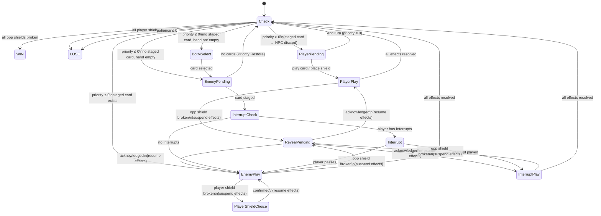

# Breakthrough — Game Design Document

> **Status:** Draft v0.2 — Core combat state machine, encounter/NPC configuration, card discovery, persistent state. Sections on card types/subtypes, modifiers, and combinations are placeholders pending design.

---

## 1. Overview

Breakthrough is a single-player detective card game. The player character (the Detective) engages in conversation-based encounters with NPCs. Each encounter is modelled as a card game: the Detective plays cards to break the NPC's information shields, while managing a shared resource called Priority and the NPC's Patience.

This document defines the authoritative rules for the combat system. The state machine described here is the source of truth; any implementation must conform to it.

---

## 2. Glossary

This game is keyword-driven. All mechanical terms should be used precisely and consistently across rules text, card text, and UI copy.

| Term | Definition |
|---|---|
| **Priority** | A signed integer tracking who controls the conversation. Positive = Detective's turn; zero or negative = NPC's turn. |
| **Patience** | The NPC's tolerance for the conversation. Reaching zero or below ends the encounter as a loss. |
| **Opponent Shield** | A face-down card belonging to the NPC. Breaking all opponent shields wins the encounter. |
| **Player Shield** | A face-down card placed by the Detective for protection. Breaking all player shields loses the encounter (if applicable). |
| **Hint** | A special type of Opponent Shield. When broken, displays lore text but adds no cards to the player's deck. Hint text remains visible in the shield zone after breaking. |
| **Skill Card** | A card type representing the Detective's learned abilities. Effects are always known. Kept in the Skill Deck. |
| **Information Card** | A card type representing knowledge about the world. Effects are unknown until discovered. Kept in the Information Bank. |
| **Back of Mind (BotM)** | A card held over from the player's hand when Priority shifts to the NPC. |
| **Interrupt** | A keyword on certain cards. Cards with Interrupt may be played during the NPC's turn, before the NPC's staged card resolves. They have no Priority cost. |
| **Safety** | A keyword on certain cards used as Player Shields. When a Safety shield is broken by the NPC, the NPC does not lose Patience. |
| **Trait** | A passive modifier on an NPC that affects combat behaviour throughout the encounter. Applied via encounter configuration. |
| **Relevant Cards** | Information Cards listed in an encounter's config. Only Relevant Cards reveal their effects when first played in that encounter. |
| **Discovered** | The state of an Information Card whose effect has been revealed. Discovery persists across encounters. |
| **Priority Restore** | The event that occurs whenever Priority transitions from ≤ 0 to > 0. Always triggers a fresh hand draw and sets Priority to the encounter's default restore value. |
| **Staged Card** | The NPC's currently loaded card, pending resolution. Exists between Enemy Pending and the end of Enemy Play. |
| **Retryable** | An encounter property. If true, the player may restart the encounter after losing. |
| **Persistent Break** | An opponent shield that remains broken when a retryable encounter is restarted. |
| **Deck Recycle** | When the draw pile is empty, the discard pile is reshuffled to form a new draw pile. |

---

## 3. Core Concepts

### Priority

Priority is a signed integer clamped to the range −10 to +10. It starts at a per-encounter value and changes as cards are played.

Playing a card costs the Priority value printed on the card. When Priority reaches zero or below during the player's turn, the initiative passes to the NPC. Certain events trigger a **Priority Restore**, which returns control to the Detective.

**Priority Restore event:** Triggered whenever Priority transitions from ≤ 0 to > 0, regardless of cause (shield break outcome, interrupt effect, NPC ending their turn). When triggered:
1. Priority is set to the encounter's `defaultRestorePriority` value.
2. The player draws a fresh hand (up to the hand limit). If a BotM card exists, it is returned to hand first.

### Patience

Patience is the NPC's tolerance for the conversation. It starts at a per-encounter value. If it reaches zero or below, the conversation ends immediately as a loss. Patience is modified by card effects and by certain shield break outcomes.

### Opponent Shields

Opponent shields are face-down cards placed by the NPC. They hide information. Breaking all opponent shields is the win condition.

When an opponent shield is broken:
- Its lore description is revealed via the Reveal Pending state (not its combat effect).
- If the shield is a **Hint**, no card is added to the player's deck; the lore text remains visible in the shield zone.
- Otherwise, the shield card becomes an Information Card in the player's deck for future encounters.

### Player Shields

Player shields are cards placed face-down by the Detective during their turn. Placing a shield is resolved as a card effect within Player Play State (see §4).

When the NPC breaks a player shield, the player enters Player Shield Choice State and selects which shield to sacrifice. Two break outcomes exist:

- **Effective Break** — triggered if the chosen shield has the **Safety** keyword. Outcome: NPC loses no Patience; **Priority Restore** fires.
- **Plain Break** — all other shields. Outcome: NPC loses 1 Patience; **Priority Restore** fires.

In both cases, Priority Restore fires and the player draws a fresh hand.

### Skill Cards

Skill cards represent the Detective's learned abilities. Their effects are always visible — the `???` / Discovered system does not apply to Skill cards.

### Information Cards

Information cards represent knowledge about the world. Their combat effects are hidden by default, displayed as "Unknown Effect." An Information Card's effect is **Discovered** when:

1. The card is played for the first time in an encounter where it appears in that encounter's `relevantCards` list. A reveal animation plays and the effect is shown. Discovery persists globally.
2. An external trigger from the overworld marks the card as discovered ahead of time.

Once Discovered, the card's effect is visible in all future encounters. If an Information Card is in the player's Conversation Deck for an encounter where it does not appear in `relevantCards`, it is replaced in the Conversation Deck entirely with a Ponder card (pay 1 Priority, draw 1 card). This substitution happens at deck construction time, not at play time — the Information Card is removed from the Conversation Deck and Ponder is inserted in its place. The player's global ownership of the Information Card in their Compendium is unaffected.

The fallback substitution logic should be implemented as a single replaceable function so that the fallback card or behaviour can be changed without touching deck construction broadly.

### Back of Mind (BotM)

When Priority drops to ≤ 0, the player must discard their hand but may keep one card in the BotM zone. The BotM card is the only card the player may play during the NPC's turn (if it has the **Interrupt** keyword). When Priority Restore fires, the BotM card returns to the player's hand.

### Deck Recycle

When the draw pile contains zero cards and the player would draw, the discard pile is reshuffled to form a new draw pile, then the draw proceeds.

---

## 4. State Machine

### 4.1 Design Principles

1. **No previous-state checks.** No state transition may ask "what was the previous state." All routing decisions are deterministic from current state flags alone (`stagedEnemyCard`, `pendingReveal`, `pendingShieldChoice`, `awaitingBotM`).

2. **Effect resolution is a sequential list.** Card effects resolve as an ordered list of atomic steps. The Priority cost is always deducted as step 0, before any effects run. Blocking sub-states (Reveal Pending, Player Shield Choice) suspend the list at the triggering step and resume from the next step after the block clears. This means no costs or earlier effects are ever repeated — they have already resolved before the suspension occurred.

3. **One Interrupt per staged card.** Interrupt Check is only entered from Enemy Pending. After an Interrupt is played (regardless of outcome), the sequence proceeds to Enemy Play directly — Interrupt Check is never re-evaluated for the same staged card.

---

### 4.2 State List

| State | Blocking? | Description |
|---|---|---|
| Check | No | Evaluates end conditions and routes |
| Player Pending | Yes | Waits for player action |
| Player Play | No | Resolves the player's card or shield placement |
| Reveal Pending | Yes | Player acknowledges a broken opponent shield's reveal |
| Player Shield Choice | Yes | Player selects which own shield to sacrifice |
| BotM Select | Yes | Player chooses which card to keep in Back of Mind |
| Enemy Pending | No | NPC selects and stages their next card |
| Interrupt Check | No | Determines whether player may respond |
| Interrupt | Yes | Player passes or plays an Interrupt card |
| Interrupt Play | No | Resolves the player's Interrupt card |
| Enemy Play | No | Resolves the NPC's staged card |

---

### 4.3 State Definitions

#### Check State

The routing hub. Never blocks. Transitions evaluated top to bottom; first match wins.

1. All opponent shields broken → **WIN**
2. All player shields broken *(unless `unbreakablePlayerShields` is set)* → **LOSE**
3. NPC Patience ≤ 0 → **LOSE**
4. Priority > 0 → move any staged enemy card to NPC discard → **Player Pending**
5. Priority ≤ 0 AND staged enemy card exists → **Enemy Play**
6. Priority ≤ 0 AND no staged card AND hand not empty → **BotM Select**
7. Priority ≤ 0 AND no staged card AND hand empty → **Enemy Pending**

> **Win before loss:** Rule 1 is checked before rules 2–3 so that simultaneously breaking the last opponent shield and draining Patience to zero resolves as a win.
>
> **Staged card on Priority Restore (rule 4):** When Priority transitions to > 0, the NPC's staged card is cancelled. It is moved to the NPC's discard pile — not removed from the encounter.

---

#### Player Pending State

Waits for player input. Available actions:

- **Play a card** → load card → **Player Play**
- **Place a shield** → load card as shield placement → **Player Play**
- **End Turn** (sets Priority to 0) → **Check**

> Shield placement is not a special action; it is resolved as a card effect in Player Play State. The "place this card into a shield slot" is the effect of the placement action.

---

#### Player Play State

Effect resolution sequence:

1. Deduct the card's Priority cost from current Priority. *(This step is never repeated.)*
2. For each effect in the card's effect list, in order:
   a. Resolve the effect.
   b. If the effect breaks an **opponent shield** → suspend here → **Reveal Pending**. After acknowledgement, resume from step 2c.
   c. *(next effect)*
3. Move the card to its destination zone (discard, field, consumed, or shield slot).
4. → **Check**

---

#### Reveal Pending State *(blocking)*

Triggered only when an **opponent shield** is broken. Displays the shield card's lore description (never its combat effect). If the shield is a Hint, the lore text is permanently displayed in the shield zone after this state clears.

The combat state is fully frozen during Reveal Pending. No Priority animation, BotM transition, or turn change may occur.

**On player acknowledgement:** Resume the suspended effect resolution sequence (in Player Play, Interrupt Play, or Enemy Play — whichever was active) from the step immediately after the break that triggered this state.

---

#### Player Shield Choice State *(blocking)*

Triggered when the NPC's card effect breaks a player shield. This state suspends Enemy Play's effect resolution sequence.

Sequence:
1. Player clicks a shield to select it (the card behind it is previewed).
2. Player confirms the choice.
3. Resolve break outcome:
   - **Effective Break** *(Safety keyword present)*: NPC loses 0 Patience. Priority Restore fires.
   - **Plain Break** *(all others)*: NPC loses 1 Patience. Priority Restore fires.
4. Remove shield from player's shield zone.
5. Resume the suspended Enemy Play effect sequence from the step after the break.

---

#### BotM Select State *(blocking)*

Triggered when Priority is ≤ 0 and the player has cards in hand (not yet discarded this transition).

Sequence:
1. Player selects one card from hand to keep.
2. All other hand cards are discarded.
3. Selected card is placed in the BotM zone.
4. → **Enemy Pending**

---

#### Enemy Pending State

NPC selects their next card. Immediate.

- NPC deck empty → Priority Restore fires → **Check**
- Otherwise → load top card from NPC deck as the staged card → **Interrupt Check**

---

#### Interrupt Check State

Immediate. Determines whether the player can respond before the staged card resolves.

- Player has any card with the **Interrupt** keyword in hand or BotM → **Interrupt**
- Otherwise → **Enemy Play**

---

#### Interrupt State *(blocking)*

The staged NPC card is visible. Player chooses:

- **Pass** → **Enemy Play**
- **Play an Interrupt card** → load the card → **Interrupt Play**

---

#### Interrupt Play State

Effect resolution sequence:

1. Interrupt cards have no Priority cost — skip deduction.
2. For each effect in the card's effect list, in order:
   a. Resolve the effect.
   b. If the effect breaks an **opponent shield** → suspend here → **Reveal Pending**. After acknowledgement, resume from step 2c.
   c. *(next effect)*
3. Move the Interrupt card to its destination zone.
4. → **Check**

After Interrupt Play, Check State determines the outcome:
- Priority > 0 (rule 4): staged card moved to NPC discard → **Player Pending**. Priority Restore fires. NPC card does not resolve.
- Priority ≤ 0 (rule 5): staged card still exists → **Enemy Play**. NPC card resolves. **No second Interrupt prompt** — Interrupt Check is not re-entered.

---

#### Enemy Play State

Effect resolution sequence:

1. For each effect in the NPC card's effect list, in order:
   a. Resolve the effect.
   b. If the effect breaks a **player shield** → suspend here → **Player Shield Choice**. After confirmation, resume from step 1c.
   c. If the effect breaks an **opponent shield** (self-break effects) → suspend here → **Reveal Pending**. After acknowledgement, resume from step 1c.
   d. *(next effect)*
2. Move the staged card to the NPC's discard pile. Clear `stagedEnemyCard`.
3. → **Check**

> NPC cards do not have a player-visible Priority cost. The initiative system operates at the Check State routing level.

---

### 4.4 State Diagram



---

### 4.5 Sequencing Invariants

1. **Reveal Pending is a hard gate on opponent shield breaks only.** No Priority animation, BotM transition, or turn change may occur while `pendingReveal` is set. Player shield breaks do not trigger Reveal Pending — they trigger Player Shield Choice.

2. **BotM Select and Reveal Pending are mutually exclusive.** If an effect simultaneously drains Priority to ≤ 0 and breaks an opponent shield, Reveal Pending takes precedence. BotM Select fires only after acknowledgement re-enters Check State.

3. **Player Shield Choice is a hard gate on player shield breaks.** Enemy Play's effect sequence does not continue until the player confirms their sacrifice.

4. **Win is checked before loss.** All opponent shields broken (rule 1) is evaluated before player shields broken (rule 2) and patience (rule 3).

5. **Staged card cancelled on Priority Restore goes to NPC discard.** It is not removed from the encounter.

6. **Enemy Play is entered from:** Interrupt Check (no-interrupt path), Interrupt State (player passes), or Check State (rule 5, staged card persists after interrupt). No other state transitions to Enemy Play.

7. **Interrupt Check is entered only from Enemy Pending.** It is never re-evaluated after an Interrupt Play. The player has exactly one Interrupt opportunity per staged NPC card.

8. **Effect resolution sequences are never restarted.** Blocking sub-states (Reveal Pending, Player Shield Choice) suspend and resume a sequence; they do not restart it. Priority costs are always the first step and are never repeated.

---

## 5. Encounter / NPC Configuration

Each encounter corresponds to a specific NPC. The encounter config and NPC definition are unified — the encounter *is* the character.

| Parameter | Type | Description |
|---|---|---|
| `id` | string | Unique encounter identifier |
| `displayName` | string | NPC's display name |
| `startingPriority` | number | Initial Priority value (positive = player goes first) |
| `defaultRestorePriority` | number | Priority value set on every Priority Restore event |
| `opponentPatience` | number | NPC's starting Patience |
| `opponentShields` | ShieldSlot[] | Ordered list of NPC shield definitions (see below) |
| `shieldBreakOrder` | number[] | Indices into `opponentShields` defining break sequence |
| `playerShields` | string[] | Pre-placed player shield card IDs (if any) |
| `unbreakablePlayerShields` | boolean | If true, NPC effects cannot break player shields |
| `relevantCards` | RelevantCard[] | Information Cards this NPC recognises (see below) |
| `traits` | Trait[] | Passive combat modifiers applied throughout the encounter |
| `retryable` | boolean | Whether the player may restart after losing |
| `cardOverrides` | Record\<CardId, Partial\<CardEffects\>\> | Per-card effect overrides for this encounter |
| `tutorialMode` | boolean | Enables scripted draw and NPC plays |
| `scriptedDrawOrder` | string[][] | Fixed hands per draw step (tutorialMode only) |
| `scriptedOpponentPlays` | string[] | Fixed NPC play sequence (tutorialMode only) |

### ShieldSlot

```
{
  cardId: string       // The card behind the shield
  isHint: boolean      // If true, this shield is a Hint (see §3, Hints)
}
```

### RelevantCard

```
{
  cardId: string       // Must match an Information Card ID
  discovered: boolean  // Whether the effect has already been revealed
}
```

When an undiscovered Relevant Card is played in this encounter for the first time, a reveal animation plays and `discovered` is set to true, persisting globally.

### Traits

Traits are named passive modifiers. They are evaluated at the points in the state machine where they apply. Examples:

| Trait | Effect |
|---|---|
| `Fearless` | Cards with the Intimidate effect deal no damage / have no effect |
| `Sensitive` | Cards that cause Patience loss deal 1 additional Patience loss |

*(Full trait vocabulary defined in §7 — Modifiers)*

---

## 6. Persistent State

Some combat state persists between attempts and across sessions.

### Persistent Shield Breaks

If a retryable encounter is restarted after a loss, any opponent shields that were broken in the previous attempt remain broken. The encounter loads its initial state from a global save that records which shields have been broken per encounter.

If `retryable` is false, the encounter does not save broken shield state — a loss ends that encounter permanently.

### Information Card Discovery

The `discovered` flag on each `RelevantCard` entry is stored globally (not per-encounter-attempt). Once an Information Card is discovered in any encounter, it remains discovered in all future contexts.

---

## 7. Card Types and Subtypes

*(Placeholder — Skill vs Information supertypes, card keywords, effect vocabulary, color identity)*

---

## 8. NPC Traits and Modifiers

*(Placeholder — full trait vocabulary, modifier stacking rules, interaction with card effects)*

---

## 9. Combinations

*(Placeholder — combination recipe system, ingredient resolution, combined card effects)*

---

*End of document — v0.2*
