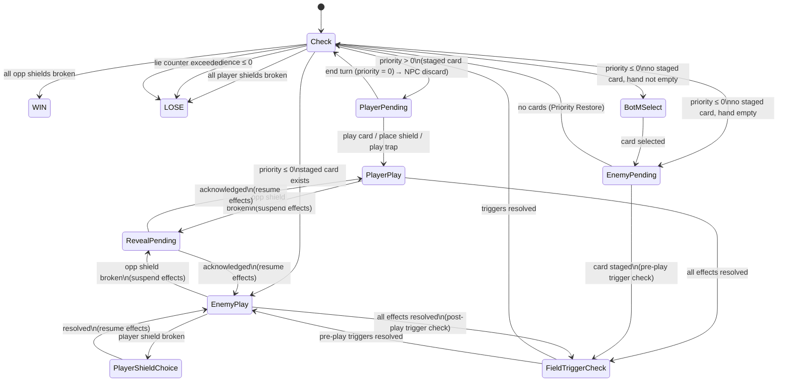

# Breakthrough — Game Design Document

> **Status:** Draft v1.1 — Major combat system rework: interrupts removed, shield taxonomy (dummy/core), trap cards, trigger resolution ordering, alternative priority mode. See Changelog.

---

## Changelog

Changes are listed in reverse chronological order. Each entry describes what changed in the design; the body of the document always reflects the current state of the design.

### v1.1 — 2026-06-21

- **Interrupts removed.** The Interrupt keyword, Interrupt Check state, Interrupt state, and Interrupt Play state are all removed. Players no longer receive input prompts during the opponent's turn. Field trigger checks (Shield Triggers, Trap triggers) replace the interrupt-checking model.
- **No automatic turn-ending.** The player must always explicitly click "End Turn" to end their turn, even if Priority reaches zero and no valid moves remain.
- **Alternative game mode: Fixed Priority Mode.** A new mode where Priority resets to 10 at the start of each player turn (no carry-over, no overflow). Cards whose cost exceeds current Priority cannot be played unless a specific effect grants an exception.
- **Dummy Shields and Core Shields.** New shield taxonomy replacing the flat player shield model. All Dummy Shields must be broken before Core Shields become targetable. Breaking a Dummy Shield reduces the shield owner's Patience by 1. Core Shields are encounter-configured (not player-chosen) and carry powerful Shield Triggers.
- **Counter renamed to Shield Trigger.** The "Counter" keyword is now called "Shield Trigger." The mechanic is unchanged in principle but now fires in shield-break order (see trigger resolution ordering below).
- **Dummy shield multi-break allowed; Core shield single-break enforced.** A single card effect may break multiple Dummy Shields but may never break more than one Core Shield. This is a hard design invariant.
- **Trap cards introduced.** A new card category that persists on the battlefield through the opponent's next turn and triggers only when a defined condition is met. Untriggered Traps expire to discard when it is the player's turn again.
- **Free shield resequencing.** Players may freely reorder their shield row at any time during their turn. Shields always trigger/break left-to-right.
- **Multi-effect trigger priority ordering.** When a single card triggers multiple effects, resolution order is: Traps first, then Shield Triggers. Among multiple Shield Triggers, order follows shield-break order. Among multiple Traps, order follows play order (oldest first).
- **Patience has no maximum cap.** There is a default starting Patience per encounter but no upper bound. Patience-restoring effects can exceed the starting value.

---

## 1. Overview

Breakthrough is a single-player detective card game. The player character (the Detective) engages in conversation-based encounters with NPCs. Each encounter is modelled as a card game: the Detective plays cards to break the NPC's information shields, while managing a shared resource called Priority and the NPC's Patience.

This document defines the authoritative rules for the combat system. The state machine described here is the source of truth; any implementation must conform to it.

---

## 2. Glossary

This game is keyword-driven. All mechanical terms should be used precisely and consistently across rules text, card text, and UI copy.

| Term | Definition |
|---|---|
| **Priority** | A signed integer tracking who controls the conversation. Positive = Detective's turn; zero or negative = NPC's turn. |
| **Patience** | The NPC's tolerance for the conversation. Has a starting value per encounter but no maximum cap. Reaching zero or below ends the encounter as a loss. |
| **Shield Trigger** | A keyword on certain cards used as Player Shields. When a shield with Shield Trigger is broken, its printed effects resolve before the break outcome fires. Formerly called "Counter." |
| **Opponent Shield** | A face-down card belonging to the NPC. Breaking all opponent shields wins the encounter. |
| **Dummy Shield** | A Player Shield that must be broken before Core Shields become targetable. Breaking a Dummy Shield costs the shield's owner 1 Patience. |
| **Core Shield** | A Player Shield configured per-encounter. Core Shields are automatically slotted if the player's Collection contains the required card. Core Shields frequently carry powerful Shield Triggers. Cannot be targeted until all Dummy Shields are broken. |
| **Player Shield** | A face-down card placed by the Detective for protection. Composed of Dummy Shields and Core Shields. |
| **Hint** | A special type of Opponent Shield. When broken, displays lore text but adds no cards to the player's deck. Hint text remains visible in the shield zone after breaking. |
| **Skill Card** | A card type representing the Detective's learned abilities. Effects are always known. Kept in the Skill Deck. |
| **Information Card** | A card type representing knowledge about the world. Effects are unknown until discovered and vary across encounters — the effect is defined per-encounter in the encounter's `relevantCards` config, not globally. Kept in the Collection. |
| **Back of Mind (BotM)** | A card held over from the player's hand when Priority shifts to the NPC. |
| **Trap** | A card category. When played, Trap cards persist on the battlefield through the opponent's next turn. They trigger their effects only when a defined condition is met during that window. If not triggered, they expire to the discard pile when it is the player's turn again. |
| **Lie** | A keyword on certain Black cards. When a card with Lie is played, the encounter's Lie Counter increases by 1. If the Lie Counter exceeds the encounter's `lieThreshold`, the encounter ends immediately as a loss. Some NPC Traits and cards interact with the Lie Counter to impose additional penalties. |
| **Safety** | A keyword on certain cards. Has no effect when played normally. When a card with Safety is used as a Player Shield and that shield is broken, a more favourable break outcome resolves (Effective Break — NPC loses 0 Patience instead of 1). |
| **Assemble** | A keyword on certain cards. Cards with Assemble may be combined with other Assemble cards. Combining is performed from the player's hand and does not trigger a state machine transition, but does change the state of the hand. |
| **Color Identity** | The color or colors assigned to a card, determining its mechanical and thematic character. Cards may be single-colored or colorless. Color identity affects deck-building, dynamic combination naming, and certain Trait interactions. |
| **Trait** | A passive modifier on an NPC that affects combat behaviour throughout the encounter. Applied via encounter configuration. Traits are **discoverable**: before a trait's effect is triggered for the first time, it appears as a question mark icon in the UI. Once triggered, the icon changes to the trait's proper icon and hovering over it displays its passive effect description. |
| **Relevant Cards** | Information Cards listed in an encounter's config, each paired with an encounter-specific effect definition. Only Relevant Cards reveal their effects when first played in that encounter. |
| **Conversation Deck** | The deck the player prepares upon entering an encounter. Consists of the player's Skill Deck combined with a selection of Information Cards taken from the Collection. |
| **Collection** | A database of all cards the player has obtained. Cards are divided into Skill Cards and Information Cards. The Collection is the source from which the player builds their Conversation Deck. |
| **Skill Deck** | A 20-card deck built from Skill Cards chosen by the player. Combined with Information Cards to form the Conversation Deck. |
| **Discovered** | The state of an Information Card whose effect has been revealed. Discovery persists across encounters. |
| **Impression** | A card subtype native to Orange. When played, an Impression card is placed on the field rather than discarded, providing a persistent passive effect for the remainder of the encounter. |
| **Priority Restore** | The event that occurs whenever Priority transitions from ≤ 0 to > 0. Always triggers a fresh hand draw and sets Priority to the encounter's default restore value. |
| **Staged Card** | The NPC's currently loaded card, pending resolution. Exists between Enemy Pending and the end of Enemy Play. |
| **Retryable** | An encounter property. If true, the player may restart the encounter after losing. |
| **Persistent Break** | An opponent shield that remains broken when a retryable encounter is restarted. |
| **Deck Recycle** | When the draw pile is empty, the discard pile is reshuffled to form a new draw pile. |
| **Trap Zone** | The battlefield area where active (pending) Trap cards reside while awaiting their trigger condition during the opponent's turn. |
| **Field Trigger Check** | The engine step that evaluates whether any Trap triggers or Shield Triggers should fire after a card resolves. Replaces the former interrupt-checking model. |
| **Fixed Priority Mode** | An alternative game mode where Priority resets to 10 at the start of each player turn with no carry-over or overflow. |
| **Standard Priority Mode** | The default game mode where Priority carries over between turns with overflow deducted from Patience. |

---

## 3. Core Concepts

### Priority

Priority is a signed integer. In Standard Priority Mode it is clamped to the range −10 to +10. It starts at a per-encounter value and changes as cards are played.

Playing a card costs the Priority value printed on the card. The player must explicitly click "End Turn" to pass initiative to the NPC — there is no automatic turn-ending even when Priority reaches zero or no valid moves remain.

**Priority Restore event:** Triggered whenever Priority transitions from ≤ 0 to > 0, regardless of cause (shield break outcome, NPC ending their turn). When triggered:
1. Priority is set to the encounter's `defaultRestorePriority` value.
2. The player draws a fresh hand (up to the hand limit). If a BotM card exists, it is returned to hand first.

#### Priority Modes

An encounter selects one of two priority modes via the `priorityMode` config field:

**Standard Priority Mode** (default): Priority carries over between turns. Playing a card costs `min(cost, currentPriority)` from Priority, then `max(0, cost − currentPriority)` from NPC Patience (overflow). Priority is clamped to −10 to +10.

**Fixed Priority Mode**: Priority resets to 10 at the start of each player turn. There is no carry-over and no overflow — if a card's Priority cost exceeds the player's current Priority, the card simply cannot be played unless a specific card effect grants an exception. There is no Patience overflow mechanic in this mode.

### Patience

Patience is the NPC's tolerance for the conversation. It starts at a per-encounter value (default: 10). **There is no maximum Patience cap** — effects that restore or grant Patience can exceed the starting value without limit. If Patience reaches zero or below, the conversation ends immediately as a loss. Patience is modified by card effects, shield break outcomes, and Priority overflow (Standard Priority Mode only).

### Opponent Shields

Opponent shields are face-down cards placed by the NPC. They hide information. Breaking all opponent shields is the win condition.

When an opponent shield is broken:
- Its lore description is revealed via the Reveal Pending state (not its combat effect).
- If the shield is a **Hint**, no card is added to the player's deck; the lore text remains visible in the shield zone.
- Otherwise, the shield card becomes an Information Card in the player's deck for future encounters.

### Player Shields

Player shields use a two-tier taxonomy: **Dummy Shields** and **Core Shields**.

#### Dummy Shields

Dummy Shields are cards placed by the Detective during their turn (or pre-placed during the Shield Card Selection phase). **Shield Placement** is a universal Player action available for any hand card — it is not gated by card type, keyword, or supertype. Placing a card as a shield costs **2 Priority** (a fixed cost, independent of the card's printed cost) and does not resolve the card's printed effects.

All Dummy Shields must be broken before any Core Shield can be targeted. When a Dummy Shield is broken, the shield's owner loses **1 Patience**.

The player can always see their own shields face-up (the card's name, cost, keywords, and type are visible).

#### Core Shields

Core Shields are **not chosen by the player**. Each encounter defines a set of allowed Core Shield card IDs in its configuration. If the player's Collection contains any of the allowed Core Shield cards, those cards are automatically placed as Core Shields for the encounter. If the player does not own any allowed Core Shields, they simply play without them — there is no substitution mechanic.

Core Shields frequently carry powerful **Shield Trigger** effects. Core Shields can only be targeted after all Dummy Shields have been broken.

#### Shield Row Composition and Ordering

The player's shield row is laid out left-to-right with Dummy Shields first, then Core Shields. During their own turn, the player may **freely resequence** (reorder) their entire shield row at any time. Shields are always broken left-to-right when targeted by the opponent — so resequencing determines the order in which shields are broken.

When the NPC breaks a player shield, the leftmost eligible shield is targeted:
- If any Dummy Shields remain, the leftmost Dummy Shield is broken.
- Once all Dummy Shields are broken, the leftmost Core Shield is broken.

#### Shield Break Outcomes

Two break outcomes exist for Dummy Shields:

- **Effective Break** — triggered if the broken shield has the **Safety** keyword. Outcome: shield owner loses 0 Patience (instead of the normal 1); **Priority Restore** fires.
- **Plain Break** — all other Dummy Shields. Outcome: shield owner loses 1 Patience; **Priority Restore** fires.

In both cases, Priority Restore fires and the player draws a fresh hand.

Core Shield breaks always trigger Priority Restore. The Patience cost (if any) is determined by the Core Shield's own configuration or Shield Trigger effects.

> **Safety keyword clarification:** The Safety keyword has no mechanical effect when a card bearing it is played normally (i.e. not placed as a shield). Its sole purpose is to upgrade the break outcome from Plain Break to Effective Break when the card is used as a Dummy Shield.

### Shield Triggers

**Shield Trigger** (formerly "Counter") is a keyword on certain cards. When a shield with the Shield Trigger keyword is broken, its printed effects resolve as a sub-sequence before the break outcome fires.

Shield Triggers resolve in **break order**: if multiple shields with Shield Trigger are broken by the same card effect (possible for Dummy Shields), they trigger in the order their shields were broken (left-to-right, since breaks proceed left-to-right).

Shield Trigger effects do not trigger an intermediate Check State evaluation — see Sequencing Invariants.

### Trap Cards

Trap cards are a card category representing prepared responses that await specific conditions.

**Playing a Trap:** When played from hand, a Trap card is placed in the **Trap Zone** on the battlefield rather than resolving its effects immediately. The Trap's Priority cost is paid normally. The Trap card remains in the Trap Zone through the opponent's entire next turn.

**Trigger condition:** Each Trap card defines a specific trigger condition (e.g., "opponent plays a card that would break a shield," "opponent plays a card costing more than 3 Priority"). If the condition is met at any point during the opponent's turn, the Trap **triggers** — its effects resolve immediately at the point the condition was satisfied.

**Expiry:** If the opponent's turn ends without the Trap's condition being met, the Trap expires and moves to the player's discard pile untriggered when it becomes the player's turn again.

**Post-trigger:** After a Trap triggers and its effects resolve, the Trap card moves to the player's discard pile.

**Multiple Traps:** Multiple Trap cards may be in the Trap Zone simultaneously. If multiple Traps' conditions are satisfied by the same event, they trigger in **play order** (the Trap played earliest triggers first).

### Field Trigger Check

After any card resolves (player or NPC), the engine performs a **Field Trigger Check**. This replaces the former interrupt-checking model. The Field Trigger Check evaluates:

1. Whether any Trap card's trigger condition has been met.
2. Whether any Shield Trigger should fire (from shields broken during the resolving card's effects).

If triggers are found, they resolve according to the trigger resolution ordering (see §4.5). No player input is required — triggers fire automatically based on game state.

### Trigger Resolution Ordering

When a single card or event triggers multiple effects, they resolve in this fixed priority order:

1. **Trap triggers** — resolved in play order (oldest-played Trap first).
2. **Shield Triggers** — resolved in break order (the order in which their shields were broken during this resolution).

This ordering is absolute: all pending Trap triggers resolve before any Shield Triggers, regardless of the chronological order in which conditions were met.

### Skill Cards

Skill cards represent the Detective's learned abilities. Their effects are always visible — the `???` / Discovered system does not apply to Skill cards.

### Information Cards

Information cards represent knowledge about the world. Their combat effects are hidden by default, displayed as "Unknown Effect." An Information Card's effect is **Discovered** when:

1. The card is played for the first time in an encounter where it appears in that encounter's `relevantCards` list. Each encounter defines the card's effect independently — the same card may behave differently in different encounters. A reveal animation plays and the effect is shown. Discovery persists globally.
2. An external trigger from the overworld marks the card as discovered ahead of time.

Once Discovered, the card's effect is visible in all future encounters. **Important:** An Information Card has no defined combat effect in any encounter where it does not appear in that encounter's `relevantCards`. The effect vocabulary on an Information Card is always and only defined by `relevantCards` for a specific encounter. There is no "underlying" or "actual" effect to fall back to — the card is simply not meaningful in that context.

When a non-relevant Information Card is in the player's Conversation Deck, its behaviour at pre-encounter and in-encounter depends on whether it has been previously played in this encounter (tracked in `playedNonRelevantCards`):

**Case 1 — Not previously played (not in `playedNonRelevantCards`):**
- Pre-encounter Info Card selection: the card shows a `???` / Unknown effect indicator, identical to an undiscovered relevant card in appearance, but for a different reason.
- Deck construction: the card enters the Conversation Deck unchanged.
- In encounter, when played: the card converts to Ponder (pay 1 Priority, draw 1 card) at that moment. Its card ID is added to `playedNonRelevantCards` after this conversion.

**Case 2 — Previously played (in `playedNonRelevantCards`):**
- Pre-encounter Info Card selection: the card displays the text **"Will be converted to Ponder"** as a warning.
- Deck construction: the card is replaced by Ponder in the Conversation Deck before the encounter begins. A conversion animation plays to remind the player which cards were substituted.
- In encounter: the card no longer exists in the deck — only Ponder remains in its slot.

The play-time Ponder conversion logic (Case 1) should be implemented as a single replaceable function so that fallback behaviour can be changed without touching card resolution broadly. The deck-construction substitution (Case 2) is a separate step and should be implemented independently.

> **Design note for implementors:** Avoid any language that implies a non-relevant Information Card has an "actual effect" or a "hidden effect." It does not. The only source of truth for an Information Card's effect in any encounter is that encounter's `relevantCards` list. Any code or documentation that references a non-relevant card's "effect" is incorrect.

### Back of Mind (BotM)

When the player explicitly ends their turn (clicking "End Turn"), they must discard their hand but may keep one card in the BotM zone. The BotM card persists through the NPC's turn. When Priority Restore fires, the BotM card returns to the player's hand.

> **Note:** Unlike previous versions, BotM cards cannot be played during the NPC's turn (interrupts have been removed). BotM exists solely to preserve one card across the turn transition.

### Deck Recycle

When the draw pile contains zero cards and the player would draw, the discard pile is reshuffled to form a new draw pile, then the draw proceeds.

---

## 4. State Machine

### 4.1 Design Principles

1. **No previous-state checks.** No state transition may ask "what was the previous state." All routing decisions are deterministic from current state flags alone (`stagedEnemyCard`, `pendingReveal`, `pendingShieldChoice`, `awaitingBotM`, `pendingTrapTriggers`).

2. **Effect resolution is a sequential list.** Card effects resolve as an ordered list of atomic steps. The Priority cost is always deducted as step 0, before any effects run. Blocking sub-states (Reveal Pending, Player Shield Choice) suspend the list at the triggering step and resume from the next step after the block clears. This means no costs or earlier effects are ever repeated — they have already resolved before the suspension occurred.

3. **No player input during opponent's turn.** The opponent's turn runs to completion without pausing for player decisions. Field Trigger Checks fire automatically. The only blocking state during the opponent's turn is Player Shield Choice (selecting which shield is sacrificed — though with the left-to-right auto-targeting, this may also become automatic; see Open Questions).

4. **The state machine is stable; edge cases are handled at design level.** New mechanics and card effects should be designed to work within the existing state machine rather than requiring changes to it. If a proposed card effect would require a structural state machine change to handle correctly, the card effect should be redesigned first. When a state machine change is genuinely unavoidable, it constitutes a **significant version change** to this document and must be logged as such.

---

### 4.2 State List

| State | Blocking? | Description |
|---|---|---|
| Check | No | Evaluates end conditions and routes |
| Player Pending | Yes | Waits for player action |
| Player Play | No | Resolves the player's card, shield placement, or trap placement |
| Reveal Pending | Yes | Player acknowledges a broken opponent shield's reveal |
| Player Shield Choice | Yes | Player selects which own shield to sacrifice (legacy — see note below) |
| BotM Select | Yes | Player chooses which card to keep in Back of Mind |
| Enemy Pending | No | NPC selects and stages their next card |
| Field Trigger Check | No | Evaluates and resolves any pending Trap or Shield Triggers |
| Enemy Play | No | Resolves the NPC's staged card |

> **Note on Player Shield Choice:** With the introduction of left-to-right automatic shield targeting and the dummy/core ordering, Player Shield Choice may become purely automatic (the leftmost eligible shield is always broken). If so, this state can be collapsed into Enemy Play as a non-blocking resolution step. This is flagged as an open question.

---

### 4.3 State Definitions

#### Check State

The routing hub. Never blocks. Transitions evaluated top to bottom; first match wins.

1. All opponent shields broken → **WIN**
2. All player shields broken *(unless `unbreakablePlayerShields` is set)* → **LOSE**
3. NPC Patience ≤ 0 → **LOSE**
4. Lie Counter > encounter's `lieThreshold` → **LOSE**
5. Priority > 0 → move any staged enemy card to NPC discard → **Player Pending**
6. Priority ≤ 0 AND staged enemy card exists → **Enemy Play**
7. Priority ≤ 0 AND no staged card AND hand not empty → **BotM Select**
8. Priority ≤ 0 AND no staged card AND hand empty → **Enemy Pending**

> **Win before loss:** Rule 1 is checked before rules 2–4 so that simultaneously breaking the last opponent shield and draining Patience to zero resolves as a win.
>
> **Staged card on Priority Restore (rule 5):** When Priority transitions to > 0, the NPC's staged card is cancelled. It is moved to the NPC's discard pile — not removed from the encounter.

---

#### Player Pending State

Waits for player input. Available actions:

- **Play a card** → load card → **Player Play**
- **Play a Trap card** → load card as trap placement → **Player Play** (card moves to Trap Zone instead of resolving effects)
- **Place a shield** (any hand card; costs 2 Priority) → load card as shield placement → **Player Play**
- **Resequence shields** → reorder shield row (no state transition; UI-only action that updates shield ordering in state)
- **End Turn** (sets Priority to 0) → **Check**

The player must always explicitly choose "End Turn" to end their turn. There is no automatic turn-ending — even if Priority is at zero and no valid moves remain, the player retains control until they click End Turn.

> Shield Placement is a distinct Player action. Any hand card may be placed as a shield. The fixed cost of 2 Priority is deducted (with Patience overflow in Standard Priority Mode). The card's printed effects do NOT resolve — only the placement itself happens (card moves from hand to the leftmost empty Dummy Shield slot). This is resolved as a unique effect sequence in Player Play State, separate from the card's own effect list.

---

#### Player Play State

Effect resolution sequence:

1. Deduct the card's Priority cost:
   - **Standard Priority Mode:** Pay `min(cost, currentPriority)` from Priority, then pay `max(0, cost − currentPriority)` from NPC Patience. Both deductions are atomic and this step is never repeated. If NPC Patience reaches ≤ 0 after this deduction, the game proceeds to Check State after all effects resolve.
   - **Fixed Priority Mode:** Deduct full cost from Priority. (Cards with cost > currentPriority cannot be played in this mode unless a specific effect grants an exception — this is validated before entering Player Play.)
2. For each effect in the card's effect list, in order:
   a. Resolve the effect.
   b. If the effect breaks an **opponent shield** → suspend here → **Reveal Pending**. After acknowledgement, resume from step 2c.
   c. *(next effect)*
3. Move the card to its destination zone (discard, field, consumed, shield slot, or Trap Zone).
4. Perform **Field Trigger Check** (evaluate any triggers caused by this card's resolution).
5. → **Check**

---

#### Reveal Pending State *(blocking)*

Triggered only when an **opponent shield** is broken. Displays the shield card's lore description (never its combat effect). If the shield is a Hint, the lore text is permanently displayed in the shield zone after this state clears.

The combat state is fully frozen during Reveal Pending. No Priority animation, BotM transition, or turn change may occur.

**On player acknowledgement:** Resume the suspended effect resolution sequence (in Player Play or Enemy Play — whichever was active) from the step immediately after the break that triggered this state.

---

#### Player Shield Choice State *(blocking)*

Triggered when the NPC's card effect breaks a player shield. This state suspends Enemy Play's effect resolution sequence.

With the new shield targeting rules (leftmost eligible shield is always broken), this state may be simplified to an automatic resolution. If manual choice is retained:

Sequence:
1. The leftmost eligible shield is targeted (leftmost Dummy Shield if any remain; otherwise leftmost Core Shield).
2. If the targeted shield has the **Shield Trigger** keyword: its printed effects resolve as a sub-sequence. If a Shield Trigger effect breaks an opponent shield, Reveal Pending fires and suspends this sequence until acknowledged.
3. Resolve break outcome:
   - For Dummy Shields:
     - **Effective Break** *(Safety keyword present)*: shield owner loses 0 Patience. Priority Restore fires.
     - **Plain Break** *(all others)*: shield owner loses 1 Patience. Priority Restore fires.
   - For Core Shields: Priority Restore fires. Additional Patience effects are determined by the Core Shield's Shield Trigger (if any).
4. Remove shield from player's shield zone.
5. Resume the suspended Enemy Play effect sequence from the step after the break.

---

#### BotM Select State *(blocking)*

Triggered when the player explicitly ends their turn and has cards in hand.

Sequence:
1. Player selects up to one card from hand to keep, or passes (keeps no cards).
2. All other hand cards (or all hand cards, if the player passed) are discarded.
3. If a card was selected, it is placed in the BotM zone.
4. → **Enemy Pending**

---

#### Enemy Pending State

NPC selects their next card. Immediate.

- NPC deck empty → Priority Restore fires → **Check**
- Otherwise → load top card from NPC deck as the staged card → **Field Trigger Check** (pre-play check for Trap conditions triggered by staging) → **Enemy Play**

---

#### Field Trigger Check State

Immediate (non-blocking). Evaluates whether any field triggers should fire based on the current game event.

Evaluation order (fixed — this is the canonical trigger resolution ordering):
1. **Trap triggers:** Check each Trap in the Trap Zone (in play order, oldest first) for whether its trigger condition is met. If met, resolve the Trap's effects, then move it to the player's discard pile.
2. **Shield Triggers:** Check for any Shield Trigger effects pending from shields broken during this resolution. If pending, resolve them in break order (the order in which their shields were broken).

After all triggers resolve:
- If entered from Enemy Pending (pre-play trigger check) → **Enemy Play**
- If entered from Enemy Play (post-effect trigger check) → **Check**
- If entered from Player Play (post-effect trigger check) → **Check**

---

#### Enemy Play State

Effect resolution sequence:

1. For each effect in the NPC card's effect list, in order:
   a. Resolve the effect.
   b. If the effect breaks a **player shield** → resolve via shield targeting rules (leftmost eligible shield). If the shield has a Shield Trigger, queue it for the Field Trigger Check. Perform Patience deduction per break outcome rules.
   c. If the effect breaks an **opponent shield** (self-break effects) → suspend here → **Reveal Pending**. After acknowledgement, resume from step 1d.
   d. *(next effect)*
2. Move the staged card to the NPC's discard pile. Clear `stagedEnemyCard`.
3. Perform **Field Trigger Check** (evaluate Trap triggers and queued Shield Triggers from this card's resolution).
4. Check for Trap expiry: if no more NPC cards are staged (i.e., this was the NPC's last action before Priority Restore), expire all remaining untriggered Traps to the player's discard pile.
5. → **Check**

> NPC cards do not have a player-visible Priority cost. The initiative system operates at the Check State routing level.

---

### 4.4 State Diagram



---

### 4.5 Sequencing Invariants

1. **Reveal Pending is a hard gate on opponent shield breaks only.** No Priority animation, BotM transition, or turn change may occur while `pendingReveal` is set. Player shield breaks do not trigger Reveal Pending — they are resolved via the shield targeting and break outcome rules.

2. **BotM Select and Reveal Pending are mutually exclusive.** If an effect simultaneously drains Priority to ≤ 0 and breaks an opponent shield, Reveal Pending takes precedence. BotM Select fires only after acknowledgement re-enters Check State.

3. **Player Shield Choice is a hard gate on player shield breaks.** Enemy Play's effect sequence does not continue until the shield break is resolved (whether manually or automatically via left-to-right targeting).

4. **Win is checked before loss.** All opponent shields broken (rule 1) is evaluated before player shields broken (rule 2) and patience (rule 3).

5. **Staged card cancelled on Priority Restore goes to NPC discard.** It is not removed from the encounter.

6. **Enemy Play is entered from:** Field Trigger Check (pre-play path from Enemy Pending) or Check State (rule 6, staged card persists). No other state transitions to Enemy Play.

7. **No player input during opponent's turn.** The opponent's turn runs without interruption. Field Trigger Checks fire automatically. The only potential blocking state is Player Shield Choice (if manual shield selection is retained).

8. **Effect resolution sequences are never restarted.** Blocking sub-states (Reveal Pending, Player Shield Choice) suspend and resume a sequence; they do not restart it. Priority costs are always the first step and are never repeated.

9. **Patience overflow is deducted in step 0 of Player Play (Standard Priority Mode only), not checked mid-resolution.** If paying Patience overflow brings NPC Patience to ≤ 0, the loss condition is not evaluated until Check State after all effects resolve. The win-before-loss invariant (rule 4) still applies.

10. **Shield Trigger effects do not trigger a Check State evaluation mid-sequence.** Shield Trigger effects resolve as a sub-sequence within the shield break resolution. No Check State evaluation occurs between the conclusion of Shield Trigger effects and the resumption of the parent effect sequence. Consequently:
    - Win and loss conditions altered by Shield Trigger effects (e.g. opponent shields broken, Patience reduced) are evaluated in Check State only after the parent play state completes fully.
    - If a Shield Trigger effect triggers a Priority Restore, the restored Priority value takes effect immediately, but the routing consequence (transitioning to Player Pending) does not occur until Check State is reached.
    - The win-before-loss ordering in Check State (rule 1 before rules 2–4) still applies.

11. **Dummy shield multi-break; Core shield single-break.** A single card effect may break multiple Dummy Shields in one resolution. A single card effect may **never** break more than one Core Shield — this is a hard design invariant enforced at card design time. Combined cards produced by Assemble must also respect this constraint.

12. **Trigger resolution ordering is absolute.** When multiple triggers fire from a single event: Traps resolve first (in play order), then Shield Triggers (in break order). This ordering cannot be overridden by card effects.

13. **Trap expiry occurs at turn transition.** Untriggered Traps are moved to discard only when Priority Restore fires (transitioning back to the player's turn), not mid-sequence.

14. **Shield resequencing is free during player's turn.** Resequencing does not consume Priority, does not trigger state transitions, and does not interact with any trigger evaluation. It only affects the physical ordering of shields for future break-targeting.

---

## 5. Encounter / NPC Configuration

Each encounter corresponds to a specific NPC. The encounter config and NPC definition are unified — the encounter *is* the character.

| Parameter | Type | Description |
|---|---|---|
| `id` | string | Unique encounter identifier |
| `displayName` | string | NPC's display name |
| `startingPriority` | number | Initial Priority value (positive = player goes first) |
| `defaultRestorePriority` | number | Priority value set on every Priority Restore event |
| `priorityMode` | `"standard"` \| `"fixed"` | Which priority model this encounter uses (default: `"standard"`) |
| `opponentPatience` | number | NPC's starting Patience (no maximum cap) |
| `opponentShields` | ShieldSlot[] | Ordered list of NPC shield definitions (see below) |
| `shieldBreakOrder` | number[] | Indices into `opponentShields` defining break sequence |
| `playerDummyShieldSlots` | number | Number of Dummy Shield slots available to the player |
| `allowedCoreShields` | string[] | Card IDs that may serve as Core Shields for this encounter. If the player's Collection contains these cards, they are automatically placed. |
| `unbreakablePlayerShields` | boolean | If true, NPC effects cannot break player shields |
| `relevantCards` | RelevantCard[] | Information Cards this NPC recognises (see below) |
| `traits` | Trait[] | Passive combat modifiers applied throughout the encounter |
| `retryable` | boolean | Whether the player may restart after losing |
| `tutorialMode` | boolean | Enables scripted draw and NPC plays |
| `scriptedDrawOrder` | string[][] | Fixed hands per draw step (tutorialMode only) |
| `scriptedOpponentPlays` | string[] | Fixed NPC play sequence (tutorialMode only) |
| `lieThreshold` | number | Maximum Lie Counter value before the encounter ends as a loss. Set to 0 or omit to disable the Lie mechanic for this encounter. |
| `playedNonRelevantCards` | string[] | IDs of Information Cards that have been played in this encounter at play-time (whether relevant or not). Persists across retries. |

### ShieldSlot

```
{
  cardId: string       // The card behind the shield
  isHint: boolean      // If true, this shield is a Hint (see §3, Hints)
}
```

### RelevantCard

```
{
  cardId: string             // Must match an Information Card ID
  effects: CardEffect[]      // This card's effect definition in this encounter
  effectDescription: string  // Human-readable description shown on discovery
  discovered: boolean        // Whether the effect has already been revealed
}
```

When an undiscovered Relevant Card is played in this encounter for the first time, a reveal animation plays showing `effectDescription`, and `discovered` is set to true, persisting globally. The same card may have different `effects` and `effectDescription` in different encounters.

### Traits

Traits are named passive modifiers. They are evaluated at the points in the state machine where they apply.

**Discoverability:** Each trait has two UI states:
- **Undiscovered** — displayed as a `?` icon in the NPC trait zone. The player knows the NPC has a special behaviour but not what it is.
- **Discovered** — displayed as the trait's proper icon. Hovering over the icon shows the trait's passive effect description. Discovery is triggered the first time the trait's effect fires during an encounter.

Discovery of traits is persistent: once a trait is discovered on a given NPC, it is shown as discovered in all future encounters with that NPC.

Examples:

| Trait | Effect |
|---|---|
| `Fearless` | Cards with the Intimidate effect deal no damage / have no effect |
| `Sensitive` | Cards that cause Patience loss deal 1 additional Patience loss |

*(Full trait vocabulary defined in §9 — NPC Traits and Modifiers)*

---

## 6. Pre-Encounter Phase

The pre-encounter phase occurs before the combat state machine starts. It consists of two stages. Both stages are skipped for tutorial encounters where configuration is fully scripted.

### 6.1 Information Card Selection *(Advanced — Placeholder)*

When the player's Collection contains more Information Cards than a defined threshold, a pre-encounter selection screen allows the player to review and choose which Information Cards to include in their Conversation Deck for the upcoming encounter.

Cards in the Info Card selection screen are displayed in one of three states:
- **Relevant** (`relevantCards` contains this card): highlighted. Effect will be revealed on first play.
- **Non-relevant, not previously played** (not in `relevantCards`, not in `playedNonRelevantCards`): displays `???` / Unknown effect. The player does not yet know whether this card will be useful. If brought into the encounter and played, it converts to Ponder at that moment.
- **Non-relevant, previously played** (not in `relevantCards`, present in `playedNonRelevantCards`): displays **'Will be converted to Ponder'**. If confirmed in the Conversation Deck, this card is substituted to Ponder at deck construction (before the encounter begins), accompanied by a conversion animation.

This stage is deferred until the Collection mechanic is fully designed. It is listed here to define its position in the game flow and the data it depends on.

### 6.2 Shield Card Selection

Before the encounter begins, the player selects which cards from their Conversation Deck to place as starting **Dummy Shields**. Any card may be placed as a Dummy Shield — this is not restricted by supertype, keyword, or color.

- The encounter config's `playerDummyShieldSlots` defines how many Dummy Shield positions are available.
- The player fills available Dummy Shield slots from their Conversation Deck.
- The player may leave Dummy Shield slots empty.
- Cards placed as starting shields are removed from the draw pile before the Conversation Deck is shuffled. They are placed face-up in the player's shield zone.
- **Core Shields** are automatically placed based on `allowedCoreShields` config and the player's Collection. The player does not choose or interact with Core Shield placement.
- This stage is always shown (unless the encounter has `unbreakablePlayerShields` set, in which case the stage may be simplified or skipped).

---

## 7. Persistent State

Some combat state persists between attempts and across sessions.

### Persistent Shield Breaks

If a retryable encounter is restarted after a loss, any opponent shields that were broken in the previous attempt remain broken. The encounter loads its initial state from a global save that records which shields have been broken per encounter.

If `retryable` is false, the encounter does not save broken shield state — a loss ends that encounter permanently.

### Information Card Discovery

The `discovered` flag on each `RelevantCard` entry is stored globally (not per-encounter-attempt). Once an Information Card is discovered in any encounter, it remains discovered in all future contexts.

### Played Non-Relevant Cards

`playedNonRelevantCards` records the IDs of Information Cards that have been played during a given encounter, including those not in `relevantCards`. This list persists across retries of retryable encounters.

Its purpose is to power the warning display in the §6.1 pre-encounter Info Card selection screen: if a card appears in `playedNonRelevantCards` and is not in `relevantCards`, the player is warned that it will resolve as Ponder in this encounter.

If `retryable` is false, `playedNonRelevantCards` is not persisted — there are no future attempts in which the warning would be relevant.

---

## 8. Card Types and Subtypes

### 8.1 Supertypes

Every card belongs to exactly one supertype.

**Skill Cards** represent the Detective's learned conversational abilities. Their effects are always visible. Skill cards are chosen from the player's Skill Deck and form the backbone of every Conversation Deck. Skill cards have a fixed color identity.

**Information Cards** represent knowledge the Detective has gathered about the world and its inhabitants. Their effects are hidden until discovered in a relevant encounter (see §3). Information Cards are colorless by default. Their effect is defined per-encounter in `relevantCards` config, not globally.

### 8.2 Subtypes

Subtypes are supplemental classifications within a supertype.

**Impression** (subtype of Skill): When played, an Impression card is placed on the field rather than being discarded. It provides a persistent passive effect for the remainder of the encounter. Impressions are removed from the field when the encounter ends. Impressions are native to Orange.

**Trap** (subtype of Skill): When played, a Trap card is placed in the Trap Zone rather than resolving its effects immediately. Traps persist through the opponent's next turn and trigger only when their defined condition is met. If untriggered, they expire to the player's discard pile at the start of the player's next turn. See §3 (Trap Cards) for full rules.

Additional subtypes will be defined as the card vocabulary expands.

### 8.2.1 Card Text Fields

Every card has two text display fields:

**Effect Text** — A short description of the card's mechanical effect. This text is displayed on the card face during combat. For Skill cards, Effect Text is also displayed on the card face within the Card Collection gallery view. When rendered on the card face, the card's keywords are automatically prepended as separate lines above the Effect Text (computed at render time, not stored in data).

**Long Description** — A longer flavour or explanatory description. This text is NOT shown on the card face by default. It is accessible via:
- A "Details" entry in the card's context menu, which opens a detail modal showing the card's full information (name, keywords, cost, Effect Text, and Long Description).
- A hover tooltip that appears when the cursor rests over the card.

The `CardDefinition` type stores these as `effectText` and `longDescription`, both optional strings. The deprecated `description` field is retained for backward compatibility but should not be used in new card data.

### 8.3 Keywords

Keywords are mechanical terms that appear on card text. All keywords expose their definitions via tooltip on hover (see §10.2).

| Keyword | Applies to | Effect |
|---|---|---|
| **Safety** | Skill | No effect when played normally. When a card with Safety is used as a Player Shield (Dummy) and that shield is broken, triggers an Effective Break — shield owner loses 0 Patience instead of 1. |
| **Assemble** | Skill / Information | This card may participate in a combination with another Assemble card. |
| **Shield Trigger** | Skill (Player Shield) | When a shield with Shield Trigger is broken, its printed effects resolve as a sub-sequence before the break outcome fires. Shield Trigger effects do not trigger an intermediate Check State evaluation — see Invariant 10. |
| **Lie** | Skill (Black) | Playing this card increments the encounter's Lie Counter by 1. If the counter exceeds the encounter's `lieThreshold`, the encounter ends as a loss. |
| **Trap** | Skill | This card is placed in the Trap Zone when played. It persists through the opponent's next turn and triggers only when its defined condition is met. |

> **Removed keyword:** The **Interrupt** keyword has been removed from the game. Cards formerly bearing Interrupt no longer have special play-during-opponent-turn capability. The interrupt-checking model has been replaced by the Field Trigger Check system. Implementation note: the `isInstant`/`isInterrupt` field naming in the codebase will need cleanup during implementation.

### 8.4 Color Identities

Color identity is a property of Skill Cards (and a small number of rare cards) that reflects the Detective's personality and conversational style. Information Cards and Ponder are colorless. Color identity informs mechanical theme, Trait interactions, and dynamic combination naming (see §10.4).

---

#### Red

Red represents a passionate, impulsive person who speaks before thinking and imposes their will with little consideration. Red gets straight to the point and hates waiting.

Mechanically, Red cards have low Priority costs and are fast to play. Red excels at eroding the NPC's Patience quickly and has tools for aggressive shield-breaking pressure, enabling a fast playstyle that overwhelms opponents before they can respond. Red players go after shields by burning through Patience and maintaining constant pressure.

---

#### Blue

Blue represents a logical, collected person who relies on reason and can articulate complex ideas convincingly — but tends to ignore the human element and can come across as cold.

Mechanically, Blue cards have higher average Priority costs but greater effects. Blue has deep access to the **Shield Trigger** keyword, reflecting the color's defensive intelligence. **Assemble** is native to Blue, representing the assembly of complex arguments from simpler components. Blue also has cards that increase BotM capacity, representing superior memory and long-term planning. Blue players invest heavily upfront for outsized payoffs.

---

#### Green

Green represents an empathetic, emotional person who cares deeply about how others feel. Considerate and patient, Green is the best listener — and understands that understanding someone takes time.

Mechanically, Green emphasizes preservation and restoration of NPC Patience, and has the best tools for discovering opponent Traits and Hints early. Green players place their own shields frequently and have access to cards with incremental effects that grow stronger the more times they are played in an encounter. Green expects long conversations and is built to sustain them.

---

#### White

White represents a spiritual or religious person whose reasoning is rooted in faith and conviction. White's perspective can seem unfathomable to outsiders, but those who share the same beliefs find White deeply resonant.

Mechanically, White has cards that allow the player to ignore the effects of certain enemy cards entirely. White also has cards that leverage low NPC Patience — their effectiveness increases as the NPC grows less tolerant. White has increased effectiveness against NPCs with the **Spiritual** Trait. White meshes well with other White cards but may struggle to convince certain personality types.

---

#### Black

Black represents an unscrupulous, cunning person who believes the ends justify the means. Black speakers manipulate, lie, and implicate others without hesitation to achieve their goals.

Mechanically, Black houses some of the strongest individual card effects in the game, offset by heavy penalties for repeated use. Black cards frequently carry the **Lie** keyword, incrementing the encounter's Lie Counter — exceeding the threshold ends the encounter as a loss. Black also has cards that reverse the negative effects of incoming enemy cards and cards that steal enemy cards within an encounter for the player's use. Black rewards risk and punishes recklessness.

---

#### Orange

Orange represents a person who appeals to authority, leverages their associations, and cultivates a specific image of themselves in the world. At their best they command an imposing presence; at their worst they are followers incapable of original thought.

Mechanically, Orange is built around **Impressions** — a card subtype that remains on the field when played, providing persistent passive effects (see §8.2). The Orange playstyle requires setup time and is context-dependent: the player performs Overworld quests to acquire Impression cards tailored to specific NPCs, building an advantageous image before the encounter begins. Orange also has powerful Skill cards that strip away enemy Traits, and is effective at detecting and countering Lie cards.

---

#### Purple

Purple represents a chaotic, theatrical, and unpredictable person — a jester, a joker, or simply someone whose behavior defies logic.

Mechanically, Purple cards lean into random chance effects. Purple also has the unique ability to permanently remove cards from both the player's Conversation Deck and the NPC's deck during an encounter, resulting in smaller deck sizes than normally possible. This is a temporary change scoped to the encounter.

---

#### Colorless

Colorless is the default identity for Information Cards and Ponder. A small number of rare Skill Cards are also colorless, representing the dry, apathetic person who offers no opinions and dampens every room they enter — difficult to get along with, yet their detachment can be tactically useful.

Colorless Skill cards (excluding Ponder and Information Cards) are characterized by effects that can end encounters early, convert both player and opponent cards into low-value filler (reducing the potential of both decks), and other effects that impose mutual costs. These cards are rare and often difficult to obtain.

---

---

## 9. NPC Traits and Modifiers

*(Placeholder — full trait vocabulary, modifier stacking rules, interaction with card effects)*

---

## 10. Combinations

The combining mechanic allows Assemble cards in the player's hand to be merged into a new, composite card. Combining does not trigger any state machine transition — the state remains in Player Pending — but the change to the hand must be communicated with a clear animation.

### 10.1 Combining Rules

- Only cards with the **Assemble** keyword may participate in a combination. A combination always involves **exactly two** Assemble cards.
- Combining is initiated by the player from the hand during Player Pending. The player selects exactly two Assemble cards and attempts to combine them.
- A combination **succeeds** if a valid recipe exists for the selected components (see §10.2).
- On success: the component cards are removed from the Conversation Deck and replaced in the hand by a single new combined card with its own effects and name.
- A combination **fails** if no valid recipe exists for the selected components. The component cards remain in hand unchanged. The player is notified that the combination failed.
- Combining does not consume Priority.

### 10.2 Recipe-Based Combinations

Recipes are predetermined pairings (or larger groupings) of card IDs that produce a specific combined card. Recipes are defined globally — they are not encounter-specific unless otherwise noted.

A recipe specifies:
- The required component card IDs (order-independent)
- The resulting combined card definition (name, effects, cost, keywords)

### 10.3 Combined Card Lifecycle

When a combined card is played:

1. The combined card is removed from the Conversation Deck.
2. Each component card is placed in the discard pile.
3. The combined card's effects resolve normally in Player Play State.

The component cards are not permanently lost — they will return to the draw pile via Deck Recycle and may be drawn and combined again in a later turn.

### 10.4 Dynamic Combining (Skill Cards with Assemble)

A Skill card that acquires the **Assemble** keyword through a card effect or modifier becomes eligible to combine. Dynamic combinations follow different rules from recipe-based combinations:

- **Skill + any Assemble card:** The Skill card's effects are appended to the other card's existing effects. The resulting card retains the other card's name, cost, and base effects, with the Skill's effects added after them.
- **Skill + Skill (both with acquired Assemble):** The two Skill cards' effects are merged. The resulting card's name is determined by the color identities of the component cards. *(Color identity is defined in §8 — Card Types and Subtypes.)* As a placeholder, all such combinations are named **"Rhetoric"**.

Dynamic combinations do not require a recipe. If a Skill card with Assemble is among the selected cards, the dynamic combining rules apply. If neither card is a Skill with acquired Assemble, a recipe is required (§10.2).

When validating a dynamic combination result, designers must verify that the combined card does not contain more than one shield-break effect across the merged effects list (see Invariant 11 — for Dummy Shields, multi-break is now allowed, but Core Shield single-break remains enforced).

### 10.5 Open Design Questions

- Whether recipes can be encounter-specific (i.e., certain combinations only work in certain contexts) is not yet defined.
- The color identity system referenced in §10.4 is pending §8.

---

## 11. UI Design Principles

These rules apply across all game screens and take precedence over convenience shortcuts in implementation. New UI work should be checked against these principles before it is considered done.

### 11.1 State Changes Are Never Silent

Any change to a quantity that affects the player's decision-making must be communicated through a visible animation or transition. Animations for separate events must play sequentially — never concurrently. The player must be able to read each change before the next one begins.

Quantities that always require animated feedback include, but are not limited to:

- **Priority** — cost deduction and any restoration
- **Patience** — any increase or decrease
- **Shield break** — opponent or player shield being broken (distinguish Dummy vs Core visually)
- **Information Card discovery** — reveal animation on first play
- **Priority Restore** — the transition event itself, distinct from the Priority value change
- **Deck Recycle** — discard pile reshuffling into draw pile
- **Priority costs** — the deduction shown at the moment a card is played
- **Trait discovery** — transition from `?` icon to proper trait icon
- **Keyword interactions** — when a keyword modifies or nullifies an effect
- **Trap placement** — card moving to Trap Zone
- **Trap trigger** — Trap activating and resolving its effect
- **Trap expiry** — untriggered Trap moving to discard
- **Shield resequencing** — shields sliding to new positions
- **Shield Trigger activation** — visual indicator that a Shield Trigger is firing

This list is non-exhaustive. When in doubt, animate it.

### 11.2 Important Information Must Be Easily Accessible

The player should never have to guess what a mechanic does. All mechanical terms, keywords, and icons should expose their definitions on demand — without navigating away from the current screen.

- **Keyword tooltips:** Keywords appearing in card text and UI copy are rendered as interactive rich text. Hovering or tapping a keyword displays its definition inline.
- **Trait tooltips:** Discovered trait icons display a description of their passive effect on hover or tap.
- **Shield contents:** Player shields are always visible face-up to the player.
- **Trap conditions:** Active Traps in the Trap Zone display their trigger condition on hover.

Information should be reachable in at most one interaction from wherever the player currently is.

### 11.3 Detail on Demand — Keep the Screen Clean

The game is information-rich. Surfacing all information at once would create clutter that harms readability. Information should be visible by default only if it is needed for every decision; otherwise it should be accessible on demand.

Guidelines:
- **Favour icons over text** in the primary game view. Labels and descriptions belong in tooltips and inspect panels, not in the default layout.
- **Do not display secondary or contextual information passively.** Card effect text, trait descriptions, and keyword definitions are revealed on hover/tap, not always visible.
- **Keep numerical displays minimal.** Show the current value; show changes via animation; do not show historical values or verbose breakdowns in the main view.
- **Shield type indicators:** Use distinct visual treatments for Dummy Shields vs Core Shields (e.g., different border styles or icons) so the player can immediately distinguish them without hovering.

When adding new UI elements, default to the minimum visible representation (icon or number) and attach detail to a hover or tap interaction.

### 11.4 Player Actions Require Implicit Confirmation

Player actions must never be triggered by a single tap or click on a card alone. All card plays and placements must require one of:
- **Drag-to-zone**: the player drags a card into a designated play zone (e.g. a highlighted "play area" that appears when a card is picked up). Releasing outside the zone cancels the action.
- **Context menu**: a right-click or long-press on a card opens a context menu with explicit options ("Play", "Place as Shield", "Set as Back of Mind", "Play as Trap" for Trap cards). Selecting an option from the menu confirms the action.

This rule exists to prevent accidental plays and to give the player a moment of consideration before committing. Buttons and confirmation dialogs for blocking sub-states (shield sacrifice, reveal dismiss) are exempt — those are already explicit.

### 11.5 Card Zone Transitions Must Be Animated

Every card movement between zones must have an accompanying Framer Motion animation. A card must never teleport between zones. Required animations for each transition:

| Transition | Animation |
|---|---|
| Deck → Hand (draw) | Card slides in from deck position, fanning into hand |
| Hand → Play zone (play) | Card lifts off hand, moves to center play zone, shrinks and dissolves |
| Hand → Shield slot (place as shield) | Card floats to shield slot, clicks into place |
| Hand → Trap Zone (play trap) | Card slides to Trap Zone, glows to indicate pending state |
| Hand → Back of Mind | Card slides to BotM zone |
| BotM → Hand (restore) | Card slides back into hand |
| Play zone → Discard | Card slides from play zone to discard pile |
| Trap Zone → Play zone (trigger) | Trap card flashes, moves to play zone, resolves, then to discard |
| Trap Zone → Discard (expire) | Trap card fades out and slides to discard |
| Enemy card → Enemy play zone (stage) | Card slides in from enemy side |
| Enemy play zone → Enemy discard | Card slides to enemy discard |
| Deck → Deck (reshuffle) | Discard pile cards animate into a stack, stack flips to become deck |
| Shield → Discard (break) | Card cracks/shakes, then slides to discard |
| Shield resequence | Shields slide smoothly to new positions |

Animations within a single turn must be sequential, never concurrent (see §11.1). Each animation should complete before the next begins. Use Framer Motion's `AnimatePresence` and layout transitions for zone entry/exit.

---

## 12. Implementation Impact / Open Questions

This section summarizes what parts of the existing combat engine architecture will require reworking when the v1.1 changes are implemented, and flags genuinely open questions that require design decisions before implementation begins.

### Architecture Impact

1. **Interrupt system removal.** The `Interrupt Check`, `Interrupt`, and `Interrupt Play` states must be removed from the combat phase state machine. All references to the `Interrupt` keyword in card definitions, the `isInstant`/`isInterrupt` fields in the type system, and the interrupt-checking logic in the reducer must be removed or repurposed. The BotM card can no longer be played during the opponent's turn.

2. **Field Trigger Check system.** A new state/step must be added to the state machine that evaluates Trap triggers and Shield Triggers after each card resolves. This requires:
   - A trigger evaluation function that checks all active Traps against their conditions
   - A queue system for pending Shield Triggers (ordered by break sequence)
   - Integration points after Player Play and Enemy Play resolution

3. **Shield zone composition (Dummy vs Core).** New state is needed for:
   - Per-shield metadata: type (dummy/core), current sequence position, Shield Trigger status, broken/intact flag
   - Encounter config: `allowedCoreShields` field, `playerDummyShieldSlots` count
   - Auto-placement logic for Core Shields based on player Collection
   - Left-to-right targeting logic replacing manual Player Shield Choice

4. **Trap Zone state.** New persistent battlefield state for:
   - Active Traps with their trigger conditions, play-order timestamp, and owning player
   - Expiry tracking tied to turn transitions (expire when Priority Restore fires)
   - Trigger condition evaluation integrated into Field Trigger Check

5. **Priority mode selection.** New game-mode state:
   - `priorityMode` field on encounter config (`"standard"` | `"fixed"`)
   - Conditional logic in Priority deduction (no overflow in Fixed mode)
   - Card playability validation (cannot play if cost > current Priority in Fixed mode, unless an exception effect is active)
   - Priority reset to 10 at start of each player turn in Fixed mode

6. **Turn-ending change.** Remove any auto-end-turn logic. The player must always explicitly trigger end turn regardless of Priority value or available moves.

7. **Multi-trigger resolution queue.** When a single card causes multiple triggers:
   - Build a resolution queue ordered by: Traps (play order) → Shield Triggers (break order)
   - Process queue sequentially
   - Handle nested triggers (a trigger's effects may cause further triggers — these are queued and processed after the current trigger completes)

8. **Shield resequencing.** UI-only action during Player Pending that updates the ordering of the shield array in state without consuming Priority or triggering transitions.

### Open Questions (Require Design Decision)

1. **What should the alternative priority mode be named?** This document uses "Fixed Priority Mode" and "Standard Priority Mode" as working names. Are these acceptable, or should they have more thematic names?

2. **Is Player Shield Choice still manual?** With left-to-right auto-targeting and the dummy-before-core constraint, the player no longer chooses which shield to sacrifice — it's always the leftmost eligible one. Should Player Shield Choice become fully automatic (removing a blocking state), or is there a reason to retain manual selection?

3. **What zone name should be used for pending Traps?** This document uses "Trap Zone." Is this acceptable, or should it have a more thematic name (e.g., "Prepared Responses," "Set Traps," "Pending Field")?

4. **Core Shield Patience cost on break:** When a Core Shield is broken, what is the Patience cost? Dummy Shields cost 1 Patience on break. Do Core Shields cost 0 (since they're meant to be powerful and have Shield Triggers), or do they also cost 1, or is it configurable per-shield?

5. **Trap trigger condition language:** How are Trap trigger conditions defined in data? Is it a structured condition object (e.g., `{ type: "opponentPlaysCard", filter: { costGreaterThan: 3 } }`), a string-based DSL, or per-card hardcoded logic? This affects both the `CardDefinition` type and the Field Trigger Check implementation.

6. **Can Traps be placed during the pre-encounter Shield Selection phase?** Or are they exclusively played from hand during combat?

7. **BotM capacity under the new system:** Previously, BotM held one card that could be played via Interrupt. Now that Interrupts are gone and BotM cards cannot be played during the opponent's turn, does the "Blue increases BotM capacity" mechanic still make sense? Should BotM capacity remain at 1, or should it be revisited?

8. **Nested triggers:** If a Trap trigger's effects break a shield that has a Shield Trigger, does the Shield Trigger queue behind remaining Traps, or does it resolve immediately as a sub-sequence of the Trap's resolution? (This document assumes sub-sequence resolution per Invariant 10, but this should be confirmed.)

9. **`encounterDefs.ts` schema:** The new fields (`allowedCoreShields`, `playerDummyShieldSlots`, `priorityMode`) need to be added to the encounter definition type. Should this be done as a breaking schema change or with backwards-compatible optional fields?

---

*End of document — v1.1*
