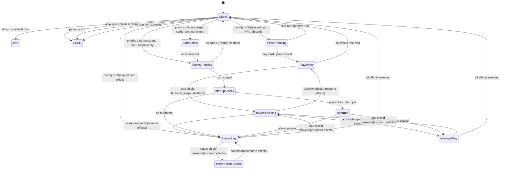

# Breakthrough — Game Design Document

> **Status:** Draft v0.7 — Core combat state machine, encounter/NPC configuration, card discovery, persistent state. Sections on card types/subtypes, modifiers, and combinations are placeholders pending design.

---

## 1. Overview

Breakthrough is a single-player detective card game. The player character (the Detective) engages in conversation-based encounters with NPCs. Each encounter is modelled as a card game: the Detective plays cards to break the NPC's information shields, while managing a shared resource called Priority and the NPC's Patience.

This document defines the authoritative rules for the combat system. The state machine described here is the source of truth; any implementation must conform to it.

---

## 2. Glossary

This game is keyword-driven. All mechanical terms should be used precisely and consistently across rules text, card text, and UI copy.

| Term | Definition |
|---|---|
| **Priority** | A signed integer tracking who controls the conversation. Positive = Detective's turn; zero or negative = NPC's turn. |
| **Patience** | The NPC's tolerance for the conversation. Reaching zero or below ends the encounter as a loss. |
| **Counter** | A keyword on certain cards used as Player Shields. When a shield with Counter is broken, its printed effects resolve before the break outcome fires. |
| **Opponent Shield** | A face-down card belonging to the NPC. Breaking all opponent shields wins the encounter. |
| **Player Shield** | A face-down card placed by the Detective for protection. Breaking all player shields loses the encounter (if applicable). |
| **Hint** | A special type of Opponent Shield. When broken, displays lore text but adds no cards to the player's deck. Hint text remains visible in the shield zone after breaking. |
| **Skill Card** | A card type representing the Detective's learned abilities. Effects are always known. Kept in the Skill Deck. |
| **Information Card** | A card type representing knowledge about the world. Effects are unknown until discovered and vary across encounters — the effect is defined per-encounter in the encounter's `relevantCards` config, not globally. Kept in the Collection. |
| **Back of Mind (BotM)** | A card held over from the player's hand when Priority shifts to the NPC. |
| **Interrupt** | A keyword on certain cards. Cards with Interrupt may be played during the NPC's turn, before the NPC's staged card resolves. They have no Priority cost. |
| **Lie** | A keyword on certain Black cards. When a card with Lie is played, the encounter's Lie Counter increases by 1. If the Lie Counter exceeds the encounter's `lieThreshold`, the encounter ends immediately as a loss. Some NPC Traits and cards interact with the Lie Counter to impose additional penalties. |
| **Safety** | A keyword on certain cards used as Player Shields. When a Safety shield is broken by the NPC, the NPC does not lose Patience. |
| **Assemble** | A keyword on certain cards. Cards with Assemble may be combined with other Assemble cards. Combining is performed from the player's hand and does not trigger a state machine transition, but does change the state of the hand. |
| **Color Identity** | The color or colors assigned to a card, determining its mechanical and thematic character. Cards may be single-colored or colorless. Color identity affects deck-building, dynamic combination naming, and certain Trait interactions. |
| **Trait** | A passive modifier on an NPC that affects combat behaviour throughout the encounter. Applied via encounter configuration. Traits are **discoverable**: before a trait's effect is triggered for the first time, it appears as a question mark icon in the UI. Once triggered, the icon changes to the trait's proper icon and hovering over it displays its passive effect description. |
| **Relevant Cards** | Information Cards listed in an encounter's config, each paired with an encounter-specific effect definition. Only Relevant Cards reveal their effects when first played in that encounter. |
| **Conversation Deck** | The deck the player prepares upon entering an encounter. Consists of the player's Skill Deck combined with a selection of Information Cards taken from the Collection. |
| **Collection** | A database of all cards the player has obtained. Cards are divided into Skill Cards and Information Cards. The Collection is the source from which the player builds their Conversation Deck. |
| **Skill Deck** | A 20-card deck built from Skill Cards chosen by the player. Combined with Information Cards to form the Conversation Deck. |
| **Discovered** | The state of an Information Card whose effect has been revealed. Discovery persists across encounters. |
| **Impression** | A card subtype native to Orange. When played, an Impression card is placed on the field rather than discarded, providing a persistent passive effect for the remainder of the encounter. |
| **Priority Restore** | The event that occurs whenever Priority transitions from ≤ 0 to > 0. Always triggers a fresh hand draw and sets Priority to the encounter's default restore value. |
| **Staged Card** | The NPC's currently loaded card, pending resolution. Exists between Enemy Pending and the end of Enemy Play. |
| **Retryable** | An encounter property. If true, the player may restart the encounter after losing. |
| **Persistent Break** | An opponent shield that remains broken when a retryable encounter is restarted. |
| **Deck Recycle** | When the draw pile is empty, the discard pile is reshuffled to form a new draw pile. |

---

## 3. Core Concepts

### Priority

Priority is a signed integer clamped to the range −10 to +10. It starts at a per-encounter value and changes as cards are played.

Playing a card costs the Priority value printed on the card. When Priority reaches zero or below during the player's turn, the initiative passes to the NPC. Certain events trigger a **Priority Restore**, which returns control to the Detective.

**Priority Restore event:** Triggered whenever Priority transitions from ≤ 0 to > 0, regardless of cause (shield break outcome, interrupt effect, NPC ending their turn). When triggered:
1. Priority is set to the encounter's `defaultRestorePriority` value.
2. The player draws a fresh hand (up to the hand limit). If a BotM card exists, it is returned to hand first.

### Patience

Patience is the NPC's tolerance for the conversation. It starts at a per-encounter value. If it reaches zero or below, the conversation ends immediately as a loss. Patience is modified by card effects and by certain shield break outcomes.

### Opponent Shields

Opponent shields are face-down cards placed by the NPC. They hide information. Breaking all opponent shields is the win condition.

When an opponent shield is broken:
- Its lore description is revealed via the Reveal Pending state (not its combat effect).
- If the shield is a **Hint**, no card is added to the player's deck; the lore text remains visible in the shield zone.
- Otherwise, the shield card becomes an Information Card in the player's deck for future encounters.

### Player Shields

Player shields are cards placed face-down by the Detective during their turn. Placing a shield is resolved as a card effect within Player Play State (see §4).

When the NPC breaks a player shield, the player enters Player Shield Choice State and selects which shield to sacrifice. Two break outcomes exist:

- **Effective Break** — triggered if the chosen shield has the **Safety** keyword. Outcome: NPC loses no Patience; **Priority Restore** fires.
- **Plain Break** — all other shields. Outcome: NPC loses 1 Patience; **Priority Restore** fires.

In both cases, Priority Restore fires and the player draws a fresh hand.

### Skill Cards

Skill cards represent the Detective's learned abilities. Their effects are always visible — the `???` / Discovered system does not apply to Skill cards.

### Information Cards

Information cards represent knowledge about the world. Their combat effects are hidden by default, displayed as "Unknown Effect." An Information Card's effect is **Discovered** when:

1. The card is played for the first time in an encounter where it appears in that encounter's `relevantCards` list. Each encounter defines the card's effect independently — the same card may behave differently in different encounters. A reveal animation plays and the effect is shown. Discovery persists globally.
2. An external trigger from the overworld marks the card as discovered ahead of time.

Once Discovered, the card's effect is visible in all future encounters. If an Information Card is in the player's Conversation Deck for an encounter where it does not appear in `relevantCards`, it is replaced in the Conversation Deck entirely with a Ponder card (pay 1 Priority, draw 1 card). This substitution happens at deck construction time, not at play time — the Information Card is removed from the Conversation Deck and Ponder is inserted in its place. The player's global ownership of the Information Card in their Compendium is unaffected.

The fallback substitution logic should be implemented as a single replaceable function so that the fallback card or behaviour can be changed without touching deck construction broadly.

### Back of Mind (BotM)

When Priority drops to ≤ 0, the player must discard their hand but may keep one card in the BotM zone. The BotM card is the only card the player may play during the NPC's turn (if it has the **Interrupt** keyword). When Priority Restore fires, the BotM card returns to the player's hand.

### Deck Recycle

When the draw pile contains zero cards and the player would draw, the discard pile is reshuffled to form a new draw pile, then the draw proceeds.

---

## 4. State Machine

### 4.1 Design Principles

1. **No previous-state checks.** No state transition may ask "what was the previous state." All routing decisions are deterministic from current state flags alone (`stagedEnemyCard`, `pendingReveal`, `pendingShieldChoice`, `awaitingBotM`).

2. **Effect resolution is a sequential list.** Card effects resolve as an ordered list of atomic steps. The Priority cost is always deducted as step 0, before any effects run. Blocking sub-states (Reveal Pending, Player Shield Choice) suspend the list at the triggering step and resume from the next step after the block clears. This means no costs or earlier effects are ever repeated — they have already resolved before the suspension occurred.

3. **One Interrupt per staged card.** Interrupt Check is only entered from Enemy Pending. After an Interrupt is played (regardless of outcome), the sequence proceeds to Enemy Play directly — Interrupt Check is never re-evaluated for the same staged card.

4. **The state machine is stable; edge cases are handled at design level.** New mechanics and card effects should be designed to work within the existing state machine rather than requiring changes to it. If a proposed card effect would require a structural state machine change to handle correctly, the card effect should be redesigned first. When a state machine change is genuinely unavoidable, it constitutes a **significant version change** to this document and must be logged as such.

---

### 4.2 State List

| State | Blocking? | Description |
|---|---|---|
| Check | No | Evaluates end conditions and routes |
| Player Pending | Yes | Waits for player action |
| Player Play | No | Resolves the player's card or shield placement |
| Reveal Pending | Yes | Player acknowledges a broken opponent shield's reveal |
| Player Shield Choice | Yes | Player selects which own shield to sacrifice |
| BotM Select | Yes | Player chooses which card to keep in Back of Mind |
| Enemy Pending | No | NPC selects and stages their next card |
| Interrupt Check | No | Determines whether player may respond |
| Interrupt | Yes | Player passes or plays an Interrupt card |
| Interrupt Play | No | Resolves the player's Interrupt card |
| Enemy Play | No | Resolves the NPC's staged card |

---

### 4.3 State Definitions

#### Check State

The routing hub. Never blocks. Transitions evaluated top to bottom; first match wins.

1. All opponent shields broken → **WIN**
2. All player shields broken *(unless `unbreakablePlayerShields` is set)* → **LOSE**
3. NPC Patience ≤ 0 → **LOSE**
4. Lie Counter > encounter's `lieThreshold` → **LOSE**
5. Priority > 0 → move any staged enemy card to NPC discard → **Player Pending**
6. Priority ≤ 0 AND staged enemy card exists → **Enemy Play**
7. Priority ≤ 0 AND no staged card AND hand not empty → **BotM Select**
8. Priority ≤ 0 AND no staged card AND hand empty → **Enemy Pending**

> **Win before loss:** Rule 1 is checked before rules 2–4 so that simultaneously breaking the last opponent shield and draining Patience to zero resolves as a win.
>
> **Staged card on Priority Restore (rule 5):** When Priority transitions to > 0, the NPC's staged card is cancelled. It is moved to the NPC's discard pile — not removed from the encounter.

---

#### Player Pending State

Waits for player input. Available actions:

- **Play a card** → load card → **Player Play**
- **Place a shield** → load card as shield placement → **Player Play**
- **End Turn** (sets Priority to 0) → **Check**

> Shield placement is not a special action; it is resolved as a card effect in Player Play State. The "place this card into a shield slot" is the effect of the placement action.

---

#### Player Play State

Effect resolution sequence:

1. Deduct the card's Priority cost: pay min(cost, currentPriority) from Priority, then pay max(0, cost − currentPriority) from NPC Patience. Both deductions are atomic and this step is never repeated. If NPC Patience reaches ≤ 0 after this deduction, the game proceeds to Check State after all effects resolve — the loss condition (rule 3) is evaluated there, after rule 1 (win condition), consistent with the win-before-loss invariant.
2. For each effect in the card's effect list, in order:
   a. Resolve the effect.
   b. If the effect breaks an **opponent shield** → suspend here → **Reveal Pending**. After acknowledgement, resume from step 2c.
   c. *(next effect)*
3. Move the card to its destination zone (discard, field, consumed, or shield slot).
4. → **Check**

---

#### Reveal Pending State *(blocking)*

Triggered only when an **opponent shield** is broken. Displays the shield card's lore description (never its combat effect). If the shield is a Hint, the lore text is permanently displayed in the shield zone after this state clears.

The combat state is fully frozen during Reveal Pending. No Priority animation, BotM transition, or turn change may occur.

**On player acknowledgement:** Resume the suspended effect resolution sequence (in Player Play, Interrupt Play, or Enemy Play — whichever was active) from the step immediately after the break that triggered this state.

---

#### Player Shield Choice State *(blocking)*

Triggered when the NPC's card effect breaks a player shield. This state suspends Enemy Play's effect resolution sequence.

Sequence:
1. Player clicks a shield to select it (the card behind it is previewed).
2. Player confirms the choice.
3. If the sacrificed shield has the **Counter** keyword: resolve its printed effects as a sub-sequence. If a Counter effect breaks an opponent shield, Reveal Pending fires and suspends this sequence until acknowledged.
4. Resolve break outcome:
   - **Effective Break** *(Safety keyword present)*: NPC loses 0 Patience. Priority Restore fires.
   - **Plain Break** *(all others)*: NPC loses 1 Patience. Priority Restore fires.
5. Remove shield from player's shield zone.
6. Resume the suspended Enemy Play effect sequence from the step after the break.

---

#### BotM Select State *(blocking)*

Triggered when Priority is ≤ 0 and the player has cards in hand (not yet discarded this transition).

Sequence:
1. Player selects one card from hand to keep.
2. All other hand cards are discarded.
3. Selected card is placed in the BotM zone.
4. → **Enemy Pending**

---

#### Enemy Pending State

NPC selects their next card. Immediate.

- NPC deck empty → Priority Restore fires → **Check**
- Otherwise → load top card from NPC deck as the staged card → **Interrupt Check**

---

#### Interrupt Check State

Immediate. Determines whether the player can respond before the staged card resolves.

- Player has any card with the **Interrupt** keyword in hand or BotM → **Interrupt**
- Otherwise → **Enemy Play**

---

#### Interrupt State *(blocking)*

The staged NPC card is visible. Player chooses:

- **Pass** → **Enemy Play**
- **Play an Interrupt card** → load the card → **Interrupt Play**

---

#### Interrupt Play State

Effect resolution sequence:

1. Interrupt cards have no Priority cost — skip deduction.
2. For each effect in the card's effect list, in order:
   a. Resolve the effect.
   b. If the effect breaks an **opponent shield** → suspend here → **Reveal Pending**. After acknowledgement, resume from step 2c.
   c. *(next effect)*
3. Move the Interrupt card to its destination zone.
4. → **Check**

After Interrupt Play, Check State determines the outcome:
- Priority > 0 (rule 4): staged card moved to NPC discard → **Player Pending**. Priority Restore fires. NPC card does not resolve.
- Priority ≤ 0 (rule 5): staged card still exists → **Enemy Play**. NPC card resolves. **No second Interrupt prompt** — Interrupt Check is not re-entered.

---

#### Enemy Play State

Effect resolution sequence:

1. For each effect in the NPC card's effect list, in order:
   a. Resolve the effect.
   b. If the effect breaks a **player shield** → suspend here → **Player Shield Choice**. After confirmation, resume from step 1c.
   c. If the effect breaks an **opponent shield** (self-break effects) → suspend here → **Reveal Pending**. After acknowledgement, resume from step 1c.
   d. *(next effect)*
2. Move the staged card to the NPC's discard pile. Clear `stagedEnemyCard`.
3. → **Check**

> NPC cards do not have a player-visible Priority cost. The initiative system operates at the Check State routing level.

---

### 4.4 State Diagram



---

### 4.5 Sequencing Invariants

1. **Reveal Pending is a hard gate on opponent shield breaks only.** No Priority animation, BotM transition, or turn change may occur while `pendingReveal` is set. Player shield breaks do not trigger Reveal Pending — they trigger Player Shield Choice.

2. **BotM Select and Reveal Pending are mutually exclusive.** If an effect simultaneously drains Priority to ≤ 0 and breaks an opponent shield, Reveal Pending takes precedence. BotM Select fires only after acknowledgement re-enters Check State.

3. **Player Shield Choice is a hard gate on player shield breaks.** Enemy Play's effect sequence does not continue until the player confirms their sacrifice.

4. **Win is checked before loss.** All opponent shields broken (rule 1) is evaluated before player shields broken (rule 2) and patience (rule 3).

5. **Staged card cancelled on Priority Restore goes to NPC discard.** It is not removed from the encounter.

6. **Enemy Play is entered from:** Interrupt Check (no-interrupt path), Interrupt State (player passes), or Check State (rule 5, staged card persists after interrupt). No other state transitions to Enemy Play.

7. **Interrupt Check is entered only from Enemy Pending.** It is never re-evaluated after an Interrupt Play. The player has exactly one Interrupt opportunity per staged NPC card.

8. **Effect resolution sequences are never restarted.** Blocking sub-states (Reveal Pending, Player Shield Choice) suspend and resume a sequence; they do not restart it. Priority costs are always the first step and are never repeated.

9. **Patience overflow is deducted in step 0 of Player Play, not checked mid-resolution.** If paying Patience overflow brings NPC Patience to ≤ 0, the loss condition is not evaluated until Check State after all effects resolve. The win-before-loss invariant (rule 4 before rule 5) still applies.

10. **Counter effects do not trigger a Check State evaluation mid-sequence.** Counter effects resolve as a sub-sequence within Player Shield Choice State. No Check State evaluation occurs between the conclusion of Counter effects and the resumption of Enemy Play. Consequently:
    - Win and loss conditions altered by Counter effects (e.g. opponent shields broken, Patience reduced) are evaluated in Check State only after Enemy Play completes fully.
    - If a Counter effect triggers a Priority Restore, the restored Priority value takes effect immediately, but the routing consequence (transitioning to Player Pending) does not occur until Check State is reached after Enemy Play.
    - The win-before-loss ordering in Check State (rule 1 before rules 2–4) still applies. If Counter effects simultaneously deplete both sides' shields, the player wins.

11. **A card may contain at most one shield-break effect.** This constraint is enforced at card design time, not in code. Combined cards produced by Assemble must not contain more than one shield-break effect — designers must verify this when authoring combination recipes and dynamic combining results. The purpose of this rule is to keep the Counter sub-sequence and shield break handling tractable within the stable state machine.

---

## 5. Encounter / NPC Configuration

Each encounter corresponds to a specific NPC. The encounter config and NPC definition are unified — the encounter *is* the character.

| Parameter | Type | Description |
|---|---|---|
| `id` | string | Unique encounter identifier |
| `displayName` | string | NPC's display name |
| `startingPriority` | number | Initial Priority value (positive = player goes first) |
| `defaultRestorePriority` | number | Priority value set on every Priority Restore event |
| `opponentPatience` | number | NPC's starting Patience |
| `opponentShields` | ShieldSlot[] | Ordered list of NPC shield definitions (see below) |
| `shieldBreakOrder` | number[] | Indices into `opponentShields` defining break sequence |
| `playerShields` | string[] | Pre-placed player shield card IDs (if any) |
| `unbreakablePlayerShields` | boolean | If true, NPC effects cannot break player shields |
| `relevantCards` | RelevantCard[] | Information Cards this NPC recognises (see below) |
| `traits` | Trait[] | Passive combat modifiers applied throughout the encounter |
| `retryable` | boolean | Whether the player may restart after losing |
| `tutorialMode` | boolean | Enables scripted draw and NPC plays |
| `scriptedDrawOrder` | string[][] | Fixed hands per draw step (tutorialMode only) |
| `scriptedOpponentPlays` | string[] | Fixed NPC play sequence (tutorialMode only) |
| `lieThreshold` | number | Maximum Lie Counter value before the encounter ends as a loss. Set to 0 or omit to disable the Lie mechanic for this encounter. |

### ShieldSlot

```
{
  cardId: string       // The card behind the shield
  isHint: boolean      // If true, this shield is a Hint (see §3, Hints)
}
```

### RelevantCard

```
{
  cardId: string             // Must match an Information Card ID
  effects: CardEffect[]      // This card's effect definition in this encounter
  effectDescription: string  // Human-readable description shown on discovery
  discovered: boolean        // Whether the effect has already been revealed
}
```

When an undiscovered Relevant Card is played in this encounter for the first time, a reveal animation plays showing `effectDescription`, and `discovered` is set to true, persisting globally. The same card may have different `effects` and `effectDescription` in different encounters.

### Traits

Traits are named passive modifiers. They are evaluated at the points in the state machine where they apply.

**Discoverability:** Each trait has two UI states:
- **Undiscovered** — displayed as a `?` icon in the NPC trait zone. The player knows the NPC has a special behaviour but not what it is.
- **Discovered** — displayed as the trait's proper icon. Hovering over the icon shows the trait's passive effect description. Discovery is triggered the first time the trait's effect fires during an encounter.

Discovery of traits is persistent: once a trait is discovered on a given NPC, it is shown as discovered in all future encounters with that NPC.

Examples:

| Trait | Effect |
|---|---|
| `Fearless` | Cards with the Intimidate effect deal no damage / have no effect |
| `Sensitive` | Cards that cause Patience loss deal 1 additional Patience loss |

*(Full trait vocabulary defined in §8 — NPC Traits and Modifiers)*

---

## 6. Persistent State

Some combat state persists between attempts and across sessions.

### Persistent Shield Breaks

If a retryable encounter is restarted after a loss, any opponent shields that were broken in the previous attempt remain broken. The encounter loads its initial state from a global save that records which shields have been broken per encounter.

If `retryable` is false, the encounter does not save broken shield state — a loss ends that encounter permanently.

### Information Card Discovery

The `discovered` flag on each `RelevantCard` entry is stored globally (not per-encounter-attempt). Once an Information Card is discovered in any encounter, it remains discovered in all future contexts.

---

## 7. Card Types and Subtypes

### 7.1 Supertypes

Every card belongs to exactly one supertype.

**Skill Cards** represent the Detective's learned conversational abilities. Their effects are always visible. Skill cards are chosen from the player's Skill Deck and form the backbone of every Conversation Deck. Skill cards have a fixed color identity.

**Information Cards** represent knowledge the Detective has gathered about the world and its inhabitants. Their effects are hidden until discovered in a relevant encounter (see §3). Information Cards are colorless by default. Their effect is defined per-encounter in `relevantCards` config, not globally.

### 7.2 Subtypes

Subtypes are supplemental classifications within a supertype.

**Impression** (subtype of Skill): When played, an Impression card is placed on the field rather than being discarded. It provides a persistent passive effect for the remainder of the encounter. Impressions are removed from the field when the encounter ends. Impressions are native to Orange.

Additional subtypes will be defined as the card vocabulary expands.

### 7.3 Keywords

Keywords are mechanical terms that appear on card text. All keywords expose their definitions via tooltip on hover (see §10.2).

| Keyword | Applies to | Effect |
|---|---|---|
| **Interrupt** | Skill | May be played during the NPC's turn before the staged card resolves. No Priority cost. |
| **Safety** | Skill (Player Shield) | When this shield is broken, triggers an Effective Break — NPC loses 0 Patience instead of 1. |
| **Assemble** | Skill / Information | This card may participate in a combination with another Assemble card. |
| **Counter** | Skill (Player Shield) | When a shield with Counter is broken, its printed effects resolve as a sub-sequence before the break outcome fires. Counter effects do not trigger an intermediate Check State evaluation — see Invariant 10. Counter cards must contain at most one shield-break effect (see Invariant 11). |
| **Lie** | Skill (Black) | Playing this card increments the encounter's Lie Counter by 1. If the counter exceeds the encounter's `lieThreshold`, the encounter ends as a loss. |

### 7.4 Color Identities

Color identity is a property of Skill Cards (and a small number of rare cards) that reflects the Detective's personality and conversational style. Information Cards and Ponder are colorless. Color identity informs mechanical theme, Trait interactions, and dynamic combination naming (see §9.4).

---

#### Red

Red represents a passionate, impulsive person who speaks before thinking and imposes their will with little consideration. Red gets straight to the point and hates waiting.

Mechanically, Red cards have low Priority costs and are fast to play. Red excels at eroding the NPC's Patience quickly and has the largest pool of Interrupt cards, enabling an aggressive playstyle that gives opponents little opportunity to respond. Red players go after shields by burning through Patience and maintaining constant pressure.

---

#### Blue

Blue represents a logical, collected person who relies on reason and can articulate complex ideas convincingly — but tends to ignore the human element and can come across as cold.

Mechanically, Blue cards have higher average Priority costs but greater effects. Blue has deep access to the **Counter** keyword, reflecting the color's defensive intelligence. **Assemble** is native to Blue, representing the assembly of complex arguments from simpler components. Blue also has cards that increase BotM capacity, representing superior memory and long-term planning. Blue players invest heavily upfront for outsized payoffs.

---

#### Green

Green represents an empathetic, emotional person who cares deeply about how others feel. Considerate and patient, Green is the best listener — and understands that understanding someone takes time.

Mechanically, Green emphasizes preservation and restoration of NPC Patience, and has the best tools for discovering opponent Traits and Hints early. Green players place their own shields frequently and have access to cards with incremental effects that grow stronger the more times they are played in an encounter. Green expects long conversations and is built to sustain them.

---

#### White

White represents a spiritual or religious person whose reasoning is rooted in faith and conviction. White's perspective can seem unfathomable to outsiders, but those who share the same beliefs find White deeply resonant.

Mechanically, White has cards that allow the player to ignore the effects of certain enemy cards entirely. White also has cards that leverage low NPC Patience — their effectiveness increases as the NPC grows less tolerant. White has increased effectiveness against NPCs with the **Spiritual** Trait. White meshes well with other White cards but may struggle to convince certain personality types.

---

#### Black

Black represents an unscrupulous, cunning person who believes the ends justify the means. Black speakers manipulate, lie, and implicate others without hesitation to achieve their goals.

Mechanically, Black houses some of the strongest individual card effects in the game, offset by heavy penalties for repeated use. Black cards frequently carry the **Lie** keyword, incrementing the encounter's Lie Counter — exceeding the threshold ends the encounter as a loss. Black also has cards that reverse the negative effects of incoming enemy cards and cards that steal enemy cards within an encounter for the player's use. Black rewards risk and punishes recklessness.

---

#### Orange

Orange represents a person who appeals to authority, leverages their associations, and cultivates a specific image of themselves in the world. At their best they command an imposing presence; at their worst they are followers incapable of original thought.

Mechanically, Orange is built around **Impressions** — a card subtype that remains on the field when played, providing persistent passive effects (see §7.2). The Orange playstyle requires setup time and is context-dependent: the player performs Overworld quests to acquire Impression cards tailored to specific NPCs, building an advantageous image before the encounter begins. Orange also has powerful Skill cards that strip away enemy Traits, and is effective at detecting and countering Lie cards.

---

#### Purple

Purple represents a chaotic, theatrical, and unpredictable person — a jester, a joker, or simply someone whose behavior defies logic.

Mechanically, Purple cards lean into random chance effects. Purple also has the unique ability to permanently remove cards from both the player's Conversation Deck and the NPC's deck during an encounter, resulting in smaller deck sizes than normally possible. This is a temporary change scoped to the encounter.

---

#### Colorless

Colorless is the default identity for Information Cards and Ponder. A small number of rare Skill Cards are also colorless, representing the dry, apathetic person who offers no opinions and dampens every room they enter — difficult to get along with, yet their detachment can be tactically useful.

Colorless Skill cards (excluding Ponder and Information Cards) are characterized by effects that can end encounters early, convert both player and opponent cards into low-value filler (reducing the potential of both decks), and other effects that impose mutual costs. These cards are rare and often difficult to obtain.

---

---

## 8. NPC Traits and Modifiers

*(Placeholder — full trait vocabulary, modifier stacking rules, interaction with card effects)*

---

## 9. Combinations

The combining mechanic allows Assemble cards in the player's hand to be merged into a new, composite card. Combining does not trigger any state machine transition — the state remains in Player Pending — but the change to the hand must be communicated with a clear animation.

### 9.1 Combining Rules

- Only cards with the **Assemble** keyword may participate in a combination. A combination always involves **exactly two** Assemble cards.
- Combining is initiated by the player from the hand during Player Pending. The player selects exactly two Assemble cards and attempts to combine them.
- A combination **succeeds** if a valid recipe exists for the selected components (see §9.2).
- On success: the component cards are removed from the Conversation Deck and replaced in the hand by a single new combined card with its own effects and name.
- A combination **fails** if no valid recipe exists for the selected components. The component cards remain in hand unchanged. The player is notified that the combination failed.
- Combining does not consume Priority.

### 9.2 Recipe-Based Combinations

Recipes are predetermined pairings (or larger groupings) of card IDs that produce a specific combined card. Recipes are defined globally — they are not encounter-specific unless otherwise noted.

A recipe specifies:
- The required component card IDs (order-independent)
- The resulting combined card definition (name, effects, cost, keywords)

### 9.3 Combined Card Lifecycle

When a combined card is played:

1. The combined card is removed from the Conversation Deck.
2. Each component card is placed in the discard pile.
3. The combined card's effects resolve normally in Player Play State.

The component cards are not permanently lost — they will return to the draw pile via Deck Recycle and may be drawn and combined again in a later turn.

### 9.4 Dynamic Combining (Skill Cards with Assemble)

A Skill card that acquires the **Assemble** keyword through a card effect or modifier becomes eligible to combine. Dynamic combinations follow different rules from recipe-based combinations:

- **Skill + any Assemble card:** The Skill card's effects are appended to the other card's existing effects. The resulting card retains the other card's name, cost, and base effects, with the Skill's effects added after them.
- **Skill + Skill (both with acquired Assemble):** The two Skill cards' effects are merged. The resulting card's name is determined by the color identities of the component cards. *(Color identity is defined in §7 — Card Types and Subtypes, pending.)* As a placeholder, all such combinations are named **"Rhetoric"**.

Dynamic combinations do not require a recipe. If a Skill card with Assemble is among the selected cards, the dynamic combining rules apply. If neither card is a Skill with acquired Assemble, a recipe is required (§9.2).

When validating a dynamic combination result, designers must verify that the combined card does not contain more than one shield-break effect across the merged effects list. See Invariant 11.

### 9.5 Open Design Questions

- Whether recipes can be encounter-specific (i.e., certain combinations only work in certain contexts) is not yet defined.
- The color identity system referenced in §9.4 is pending §7.

---

## 10. UI Design Principles

These rules apply across all game screens and take precedence over convenience shortcuts in implementation. New UI work should be checked against these principles before it is considered done.

### 10.1 State Changes Are Never Silent

Any change to a quantity that affects the player's decision-making must be communicated through a visible animation or transition. Animations for separate events must play sequentially — never concurrently. The player must be able to read each change before the next one begins.

Quantities that always require animated feedback include, but are not limited to:

- **Priority** — cost deduction and any restoration
- **Patience** — any increase or decrease
- **Shield break** — opponent or player shield being broken
- **Information Card discovery** — reveal animation on first play
- **Priority Restore** — the transition event itself, distinct from the Priority value change
- **Deck Recycle** — discard pile reshuffling into draw pile
- **Priority costs** — the deduction shown at the moment a card is played
- **Trait discovery** — transition from `?` icon to proper trait icon
- **Keyword interactions** — when a keyword modifies or nullifies an effect

This list is non-exhaustive. When in doubt, animate it.

### 10.2 Important Information Must Be Easily Accessible

The player should never have to guess what a mechanic does. All mechanical terms, keywords, and icons should expose their definitions on demand — without navigating away from the current screen.

- **Keyword tooltips:** Keywords appearing in card text and UI copy are rendered as interactive rich text. Hovering or tapping a keyword displays its definition inline.
- **Trait tooltips:** Discovered trait icons display a description of their passive effect on hover or tap.
- **Shield contents:** Player shields may be peeked before sacrifice (see §4.3 — Player Shield Choice).

Information should be reachable in at most one interaction from wherever the player currently is.

### 10.3 Detail on Demand — Keep the Screen Clean

The game is information-rich. Surfacing all information at once would create clutter that harms readability. Information should be visible by default only if it is needed for every decision; otherwise it should be accessible on demand.

Guidelines:
- **Favour icons over text** in the primary game view. Labels and descriptions belong in tooltips and inspect panels, not in the default layout.
- **Do not display secondary or contextual information passively.** Card effect text, trait descriptions, and keyword definitions are revealed on hover/tap, not always visible.
- **Keep numerical displays minimal.** Show the current value; show changes via animation; do not show historical values or verbose breakdowns in the main view.

When adding new UI elements, default to the minimum visible representation (icon or number) and attach detail to a hover or tap interaction.

---

*End of document — v0.7*
