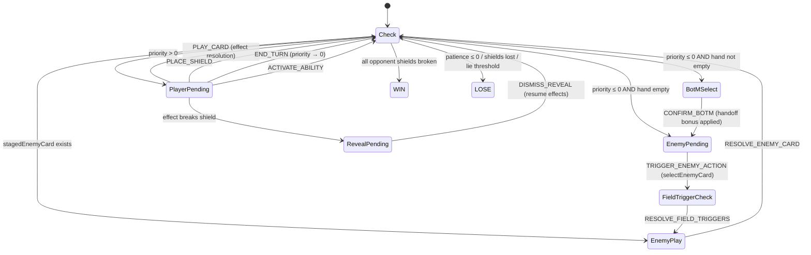
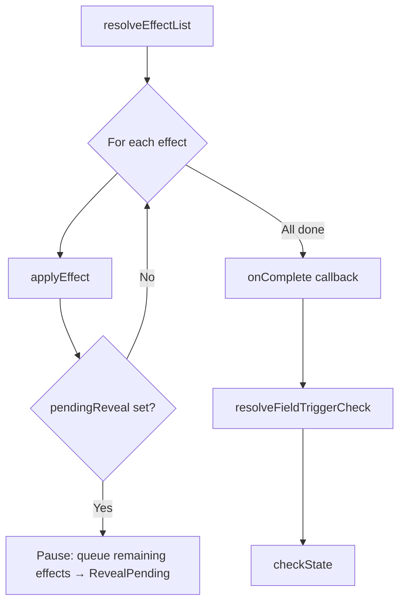
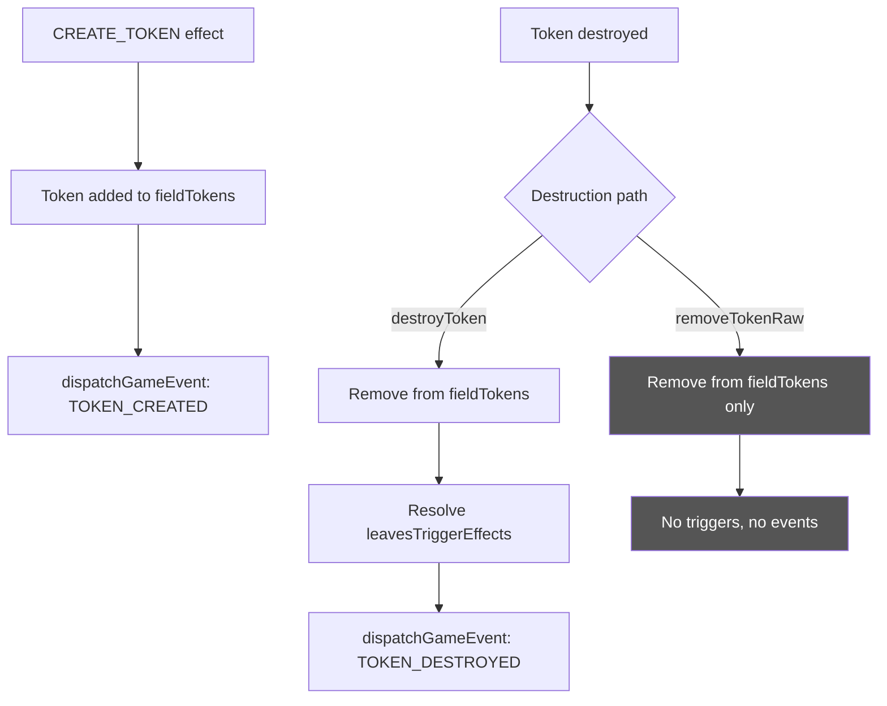
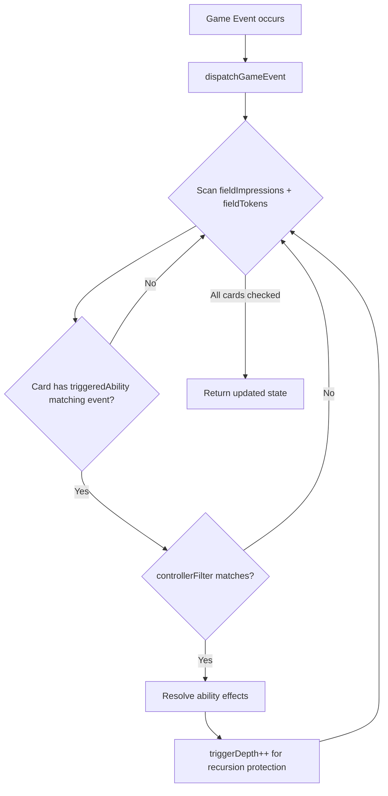

# Combat Architecture

Technical reference for the combat engine's internal systems. For game design rules, see `Breakthrough_Design.md`.

## State Machine

The combat engine is a pure reducer (`CombatState`, `CombatAction`) → `CombatState` with phase-based routing. `checkState()` is the central router that reads the current state and determines the next phase.



## Effect Resolution

Effects are resolved via `resolveEffectList(state, effects, card, onComplete)`. Each effect is applied via `applyEffect(state, effect, controller, sourceCard)`. The system supports interrupts — if a `pendingReveal` is set mid-resolution, remaining effects are queued and resumed after the player dismisses the reveal.



### Effect Types

| Effect | Description |
|--------|-------------|
| `MODIFY_PRIORITY` | Adjust shared priority meter (frame) or player meter (classic) |
| `MODIFY_PATIENCE` | Adjust NPC patience |
| `DRAW_CARDS` | Draw N cards from player deck |
| `BREAK_OPPONENT_SHIELD` | Break next shield on controller's opponent side |
| `PLACE_AS_SHIELD` | Flag card for shield placement (pending UI) |
| `INCREMENT_LIE_COUNTER` | +1 to lie counter |
| `PLACE_IMPRESSION` | Place card as persistent impression on field |
| `CREATE_TOKEN` | Create token instance(s) from registry + dispatch `TOKEN_CREATED` |
| `DESTROY_SELF` | Destroy the source card (token or impression) — routes through `destroyToken` for tokens |
| `TRANSFORM_TOKEN` | Replace token(s) of one type with another — uses `removeTokenRaw` (no triggers) |
| `DESTROY_TOKENS` | Destroy multiple tokens by definition ID or instance IDs — reveal-aware looping |
| `APPLY_RESTRICTION` | Apply a temporary restriction on a player/NPC (e.g., prevent shield breaks) |

## Active Restrictions

Restrictions are temporary rules that modify or prevent certain actions. Stored as `activeRestrictions: ActiveRestriction[]` on `CombatState`.

```typescript
interface ActiveRestriction {
  id: string;
  restrictionType: RestrictionType;  // 'PREVENT_SHIELD_BREAK' | 'MAX_CARD_COST' | 'INCREASE_CARD_COST'
  target: CardOwner;                 // who is restricted
  value?: number;                    // parameter (e.g., max cost, extra cost amount)
  turnsRemaining: number;            // decrements each turn cycle; removed at 0
}
```

- **Applied** via `APPLY_RESTRICTION` effect (restrictionType, restrictionTarget, restrictionDuration, value)
- **Enforced** inline — e.g., `BREAK_OPPONENT_SHIELD` checks for `PREVENT_SHIELD_BREAK` before executing
- **Expired** by `tickRestrictions()`, called at `priorityRestore` (frame) and `classicTurnStart` (classic)

## Token Lifecycle

Tokens are persistent field cards created by `CREATE_TOKEN` effects and stored in `CombatState.fieldTokens`. They support activated abilities (player-initiated) and leave-the-battlefield triggers (automatic on destruction).



### Two Removal Paths (by design)

- **`destroyToken(state, instanceId)`** — Full lifecycle: removes the token, fires its `leavesTriggerEffects` (with reveal-aware pausing), then dispatches `TOKEN_DESTROYED` to passive listeners. Used by: `DESTROY_SELF` effect, `DESTROY_TOKEN` action, and any future forced-destruction effects.

- **`removeTokenRaw(state, instanceId)`** — Silent removal: removes the token without firing any triggers or events. Used exclusively by `TRANSFORM_TOKEN`, where the token is being converted to another type, not leaving the battlefield.

This separation is structural, not conditional — transform must never accidentally route through `destroyToken`.

### Transform Token

`TRANSFORM_TOKEN` replaces token(s) of one definition type with another. It uses `removeTokenRaw` for the old tokens (no leave triggers) and creates new token instances, dispatching `TOKEN_CREATED` for each.

```typescript
interface CardEffect {
  type: 'TRANSFORM_TOKEN';
  transformSourceId: string;   // definition ID to find on field
  transformTargetId: string;   // definition ID to create
  value?: number;              // max count (default 1)
  transformAll?: boolean;      // transform all matching tokens
  transformUpTo?: boolean;     // allow fewer than value
}
```

### Nested Reveal Handling

When `destroyToken`'s leave-trigger effects include shield breaks, each break sets a `pendingReveal`. The system handles this correctly:

1. `destroyToken` applies leave effects one at a time
2. On `pendingReveal`, remaining leave effects are queued into `state.pendingEffects`
3. `resolveEffectList` detects the reveal and merges its own remaining effects into `pendingEffects`
4. `DISMISS_REVEAL` clears `pendingEffects` from state before resuming to prevent duplicates
5. Each reveal is shown sequentially until all effects resolve

### Token Definition Fields

```typescript
interface CardDefinition {
  // ... existing fields ...
  leavesTriggerEffects?: CardEffect[];    // fired when token is destroyed (not transformed)
  activatedAbilities?: ActivatedAbility[]; // player-initiated abilities with costs
  triggeredAbilities?: TriggeredAbility[]; // passive listeners for game events
}
```

## Game Event Dispatch

Field cards (impressions and tokens) can declare passive `triggeredAbilities` that react to game-wide events. When a game event occurs, `dispatchGameEvent(state, event)` scans all field cards for matching triggers and resolves their effects.



### Event Types

| Event | Fired when | Used by |
|-------|-----------|---------|
| `TOKEN_DESTROYED` | `destroyToken()` completes | Eloquence, Lingering Words |
| `TOKEN_CREATED` | `CREATE_TOKEN` effect resolves | (reserved for future use) |
| `CARD_PLAYED` | (not yet wired) | (reserved for future use) |
| `SHIELD_BROKEN` | (not yet wired) | (reserved for future use) |

### Triggered Ability Definition

```typescript
interface TriggeredAbility {
  id: string;
  trigger: GameEventType;        // which event to listen for
  controllerFilter?: CardOwner;  // if set, only fires when event source matches controller
  effects: CardEffect[];         // effects to resolve
}
```

Example — Eloquence: "Every time a token is destroyed, draw a card"
```typescript
triggeredAbilities: [{
  id: 'eloquence_draw',
  trigger: 'TOKEN_DESTROYED',
  effects: [{ type: 'DRAW_CARDS', value: 1 }],
}]
```

Example — Lingering Words: "Every time a token you control is destroyed, create a Logical Chain"
```typescript
triggeredAbilities: [{
  id: 'lingering_words_chain',
  trigger: 'TOKEN_DESTROYED',
  controllerFilter: 'player',
  effects: [{ type: 'CREATE_TOKEN', tokenDefinitionId: 'logical_chain', value: 1 }],
}]
```

## Recursion Protection

All trigger-based systems share the `triggerDepth` counter on `CombatState`, capped at `MAX_TRIGGER_DEPTH` (20). This prevents infinite loops from:
- Trap → effect → trap chains
- Shield trigger → effect → shield trigger chains
- Token leave trigger → create token → destroy token → leave trigger chains
- Passive listener → create token → listener chains

## Priority Modes

### Frame Mode (`'frame'`)

Single shared priority meter (clamped −10 to +10). Priority > 0 = player's turn; ≤ 0 = NPC's turn.

- Card costs deduct from priority
- NPC card costs push priority positive (self-limiting)
- `applyTurnHandoffBonus(priority, side)` adds ±3 on turn switch
- `priorityRestore` fires when priority flips from ≤ 0 to > 0: applies handoff bonus, returns BotM cards, draws to hand limit, expires traps

### Classic Mode (`'classic'`)

Separate priority meters. Explicit turn alternation via `activeTurn` flag.

## File Map

| File | Role |
|------|------|
| `src/combat/types.ts` | All TypeScript types |
| `src/combat/combatReducer.ts` | Pure reducer + `checkState` router |
| `src/combat/effectHandlers.ts` | Effect application, token lifecycle, event dispatch, priority/shield helpers |
| `src/data/devCards.ts` | Test card/token definitions |
| `src/data/encounterDefs.ts` | Test encounter configs + `buildInitialCombatState()` |
